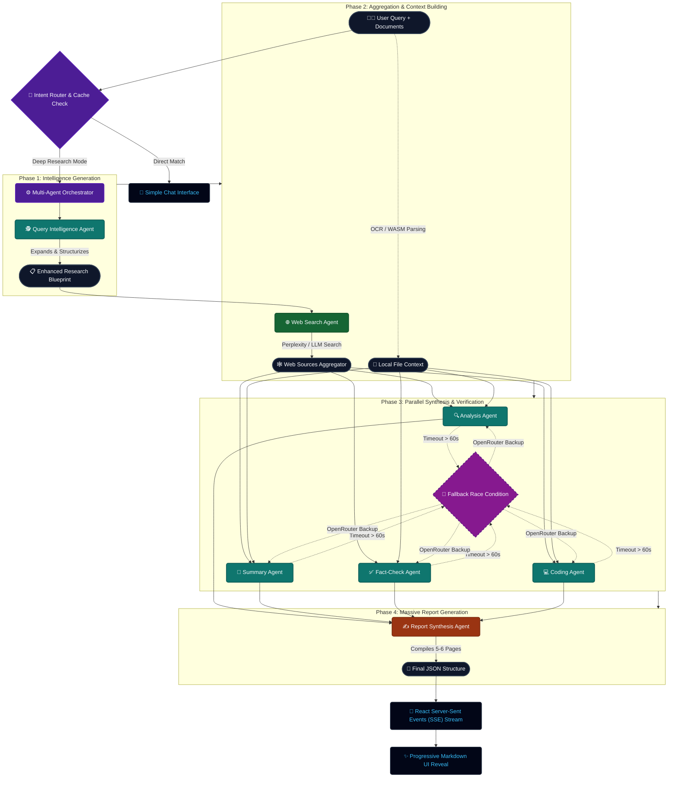

<div align="center">

# 🔬 ResAgent — Advanced Multi-Agent Research Orchestrator

[](https://nextjs.org/)
[](https://react.dev/)
[](https://www.typescriptlang.org/)
[](https://tailwindcss.com/)
[](https://www.nvidia.com/en-us/ai/)

**Next-Generation Multi-Agent Research Engine**  
*Transform raw queries into exhaustive, structured, and fact-checked intelligence reports.*

[Project Overview](#-project-overview) • [Key Features](#-key-features) • [Development Stack](#-development-stack) • [Installation](#-installation--setup) • [Configuration](#-configuration) • [Project Stats](#-project-stats--metrics) • [Usage Guide](#-usage-guide)

</div>

---

## 📋 Project Overview

**ResAgent** is a production-grade, multi-agent AI research system engineered for depth, accuracy, and scale. Unlike conventional chatbots that rely on a single model inference pass, ResAgent orchestrates a **fleet of specialized AI agents** across a four-phase pipeline to deliver exhaustive, citation-rich research reports in real time.

The architecture follows a deterministic execution model:

1. **Query Intelligence** — Deconstructs raw user intent into 8–12 structured research vectors using a reasoning-optimized LLM.
2. **Data Aggregation** — Executes concurrent web searches via Perplexity Sonar and ingests user-uploaded documents (PDF, DOCX, CSV, images) to enrich the local context.
3. **Parallel Synthesis** — Runs Analysis, Summary, Fact-Check, and Coding agents simultaneously with **dynamic model routing** and automatic fallback chains.
4. **Report Assembly** — Compiles all agent outputs into a cohesive, 4,000–6,000 word structured research document, streamed progressively via **Server-Sent Events (SSE)**.

> **💡 Unique Selling Point:** ResAgent features **Dynamic Model Routing** with automatic fallback to high-capacity context models (up to **131,072 tokens**) when primary endpoints hit rate limits. A race-condition fallback mechanism fires identical requests to OpenRouter free-tier models if the primary NVIDIA NIM endpoint stalls beyond 60 seconds, ensuring uninterrupted massive report generation under heavy load.

---

## ✨ Key Features

### 🌐 Intelligent Data Retrieval

- **Targeted Augmentation** — Concurrent, optimized web searches triggered by a Query Intelligence Agent rather than raw user input, yielding highly relevant source aggregation.
- **Citation Mapping** — Builds visual relationship nodes across all referenced sources for deep-dive verification.
- **Multi-Modal Document Intake** — Seamlessly parses user-uploaded documents to enrich local context:
  - **PDFs** via `pdfjs-dist`
  - **DOCX/Word** via `mammoth`
  - **CSV/Data Sheets** via `PapaParse`
  - **Images** via `Tesseract.js` (WebAssembly OCR)

### 🤖 Specialized Agent Fleet

| Agent | Role | Primary Model | Fallback Model |
| :--- | :--- | :--- | :--- |
| **Query Intelligence** | Expands raw queries into structured research vectors | `moonshotai/kimi-k2-thinking` | `openai/gpt-oss-120b:free` |
| **Web Search** | Executes concurrent web searches with LLM summarization | `abacusai/dracarys-llama-3.1-70b-instruct` | `meta-llama/llama-3.3-70b-instruct:free` |
| **Analysis** | Extracts non-obvious patterns via advanced reasoning | `nvidia/nemotron-3-super-120b-a12b` | `nvidia/nemotron-3-super-120b-a12b:free` |
| **Summary** | Generates high-speed overviews and distillations | `minimaxai/minimax-m2.7` | `google/gemma-4-31b-it:free` |
| **Fact-Check** | Cross-references claims, scoring reliability (0–100) | `mistralai/mistral-large-3-675b-instruct-2512` | `meta-llama/llama-3.3-70b-instruct:free` |
| **Coding** | Generates edge-case-handled code snippets | `qwen/qwen3-coder-480b-a35b-instruct` | `qwen/qwen3-coder:free` |
| **Report Synthesis** | Chief editor compiling all outputs into the final document | `moonshotai/kimi-k2-thinking` | `openai/gpt-oss-120b:free` |

### ⚡ Next-Gen UI & Streaming

- **Dynamic SSE Streaming** — Real-time agent progression, latency metrics, and progressive Markdown reveal without freezing the main UI thread.
- **Intent-Based Routing** — Automatically classifies queries as *Simple* (direct chat) or *Research* (full multi-agent pipeline), with an optional *Planning* workflow mode for iterative research design.
- **Interactive Tool Modals** — Quick Search, Citation Graph, Agent Settings, and Developer Profile accessible from the sidebar.
- **Multi-Format Export** — Download reports as **Markdown**, **PDF**, or **Plain Text**.
- **Responsive Design** — Fully adaptive layout with mobile viewport optimization, collapsible sidebar, and virtual keyboard handling.
- **Client-Side Caching** — `localStorage`-backed research cache with query-keyed history entries and progressive section reveal animations.

### 🛡️ Reliability & Fault Tolerance

- **Fallback Race Conditions** — If a primary NVIDIA NIM model stalls beyond 60 seconds, the system concurrently fires an identical request to an OpenRouter fallback and accepts whichever resolves first.
- **Retry Logic** — Configurable exponential backoff with bounded delays (500 ms – 2,000 ms).
- **Graceful Degradation** — Individual agent failures are logged and skipped without crashing the entire pipeline.

---

## 🛠️ Development Stack

### Frontend

| Technology | Version | Purpose |
| :--- | :--- | :--- |
| **Next.js** | `16.2.4` | Core framework (App Router, Turbopack) |
| **React** | `19.2.4` | UI library with concurrent features |
| **TypeScript** | `^5.0` | Type-safe development |
| **Tailwind CSS** | `v4` | Utility-first styling |
| **Framer Motion** | `^12.38.0` | Fluid animations and transitions |
| **React-Markdown** | `^10.1.0` | Memoized Markdown rendering for SSE streams |
| **Lucide React** | `^1.8.0` | Iconography |
| **shadcn/ui** | `^4.2.0` | Headless UI component primitives |
| **clsx / tailwind-merge** | `^2.1.1 / ^3.5.0` | Dynamic class name composition |
| **@base-ui/react** | `^1.4.0` | Unstyled accessible UI primitives |
| **Google Fonts** | — | Inter, Playfair Display, Geist Mono |

### Backend & Orchestration

| Technology | Version | Purpose |
| :--- | :--- | :--- |
| **Next.js API Routes** | `16.2.4` | Serverless API endpoints (`/api/research`) |
| **Node.js** | `≥18.17.0` | Runtime environment |
| **NVIDIA NIM** | — | Primary LLM inference API |
| **OpenRouter** | — | Fallback / free-tier LLM API |
| **Perplexity Sonar** | — | Real-time web search augmentation |

### Document Parsing

| Technology | Version | Purpose |
| :--- | :--- | :--- |
| **pdfjs-dist** | `^5.6.205` | PDF parsing |
| **mammoth** | `^1.12.0` | DOCX/Word extraction |
| **papaparse** | `^5.5.3` | CSV handling |
| **tesseract.js** | `^7.0.0` | Image OCR via WebAssembly |

### Export & Utilities

| Technology | Version | Purpose |
| :--- | :--- | :--- |
| **jsPDF** | `^4.2.1` | PDF report generation |
| **html-to-image** | `^1.11.13` | DOM-to-image capture |

### DevOps & Tooling

| Technology | Version | Purpose |
| :--- | :--- | :--- |
| **ESLint** | `^9.0` + `eslint-config-next` | Linting and code quality |
| **Turbopack** | Bundled with Next.js 16 | Ultra-fast development builds |
| **Git** | — | Version control |

---

## 🚀 Installation & Setup

### Prerequisites

- **Node.js** `v18.17.0` or higher
- **npm** `v9.0` or higher (or `pnpm` / `yarn`)
- **Git**
- Modern web browser with WebAssembly support (for OCR)

### Step 1: Clone the Repository

```bash
git clone https://github.com/girishlade111/research-assistant.git
cd research-assistant
```

### Step 2: Install Dependencies

```bash
npm install
```

### Step 3: Configure Environment Variables

Create a `.env.local` file in the project root:

```bash
cp .env.example .env.local
# Edit .env.local and add your API keys
```

> **⚠️ Important:** At minimum, **one** of `NVIDIA_API_KEY` or `OPENROUTER_API_KEY` must be provided. The application will refuse to start research operations if neither is configured.

### Step 4: Run the Application

#### Development Mode (with Turbopack)

```bash
npm run dev
```

The application will be available at **`http://localhost:3000`**.

#### Production Build

```bash
npm run build
npm run start
```

#### Linting

```bash
npm run lint
```

---

## ⚙️ Configuration

### Environment Variables

Create a `.env.local` file in the project root and configure the following:

```env
# ═══════════════════════════════════════════════════════════
# REQUIRED: Primary LLM Provider
# ═══════════════════════════════════════════════════════════
NVIDIA_API_KEY=your_nvidia_nim_api_key_here

# ═══════════════════════════════════════════════════════════
# OPTIONAL: Fallback LLM Provider (highly recommended)
# ═══════════════════════════════════════════════════════════
OPENROUTER_API_KEY=your_openrouter_api_key_here

# ═══════════════════════════════════════════════════════════
# OPTIONAL: Web Search Augmentation
# ═══════════════════════════════════════════════════════════
PERPLEXITY_API_KEY=your_perplexity_sonar_key_here
```

### Search Mode Configuration

The engine exposes three search tiers, defined in `lib/engine/config.ts`:

| Mode | Max Sources | Description |
| :--- | :--- | :--- |
| **Corpus** | `0` | Fast report using pure AI knowledge. No web search. |
| **Deep** | `4` | Moderate web research combined with AI analysis. |
| **Pro** | `8` | Comprehensive deep research using maximum agent capabilities. |

### Token & Timeout Governance

Hard-coded thresholds optimized for massive context management:

| Parameter | Value | Description |
| :--- | :--- | :--- |
| **Max Global Context** | `131,072` tokens | Supports massive document ingestion via Llama 3.3 70B fallback models. |
| **Report Generation Budget** | `32,768` tokens | Guarantees the Report Agent never truncates the final synthesis document. |
| **Per-Agent Budget** | `16,384` tokens | Enforces deep, one-page minimum outputs per sub-agent. |
| **Fallback Race Timeout** | `60,000` ms | Primary models are raced against fallbacks; absolute ceiling of 120 s. |
| **Max Retries** | `1` | Single retry before triggering fallback logic. |
| **Base Retry Delay** | `500` ms | Initial exponential backoff delay. |

### Workflow Modes

| Mode | Behavior |
| :--- | :--- |
| **Research** | Full multi-agent orchestration pipeline with query classification. |
| **Planning** | Interactive planning chat. Automatically transitions to Research when the system detects sufficient research intent. |

---

## 📊 Project Stats & Metrics

### Scale & Architecture

| Metric | Value |
| :--- | :--- |
| **AI Agents** | 7 specialized agents |
| **Models in Registry** | 15 (8 NVIDIA NIM + 7 OpenRouter fallbacks) |
| **API Endpoints** | 1 primary SSE stream (`/api/research`) + static pages |
| **Search Modes** | 3 (`corpus`, `deep`, `pro`) |
| **Workflow Modes** | 2 (`planning`, `research`) |
| **Supported File Types** | 4 (PDF, DOCX, CSV, Image) |
| **Export Formats** | 3 (Markdown, PDF, TXT) |

### Token Governance

| Rule | Limit |
| :--- | :--- |
| **System Context** | 32,768 tokens |
| **Max Report Output** | 16,384–32,768 tokens |
| **Per-Agent Cap** | 16,384 tokens |
| **Global Context Ceiling** | 131,072 tokens |

### Performance Targets

| Benchmark | Target |
| :--- | :--- |
| **Simple Chat Latency** | < 3 seconds (direct LLM pass) |
| **Research Pipeline Latency** | 15–60 seconds (full multi-agent orchestration) |
| **Fallback Trigger** | 60 seconds (automatic race to OpenRouter) |
| **SSE Stream Framerate** | Optimized for zero UI thread blocking during token streaming |

---

## 📖 Usage Guide

### Quick Start

1. **Enter a query** in the main search input.
2. **Select a search mode:**
   - **Corpus** — Fast report using pure AI knowledge (no web search).
   - **Deep** — Moderate web research combined with AI analysis (up to 4 sources).
   - **Pro** — Comprehensive deep research using maximum agent capabilities (up to 8 sources).
3. **Select a workflow mode:**
   - **Research** — Direct multi-agent execution.
   - **Planning** — Iterative planning chat that can auto-transition into Research.
4. **Optionally upload files** (PDF, DOCX, CSV, images) to enrich context.
5. **Toggle individual agents** on/off via the search controls for customized pipelines.
6. **Watch real-time progress** via the Agent Status Panel as the system streams the final report.
7. **Export** the result as Markdown, PDF, or Plain Text.

### Query Routing

ResAgent automatically classifies every query:

- **Simple** — Routed to a direct LLM chat response (`runSimpleChat`) for greetings, quick answers, and low-complexity questions.
- **Research** — Routed through the full multi-agent orchestrator (`runResearch`) with parallel agent execution and SSE streaming.

You can force a specific path by selecting the **Planning** workflow mode or by disabling all agents (which forces Simple Chat).

### Keyboard & Mobile

- The search bar is accessible at all times and floats responsively.
- On mobile, the layout adapts with a collapsible sidebar and viewport-aware keyboard handling.
- The application supports progressive section reveal with smooth auto-scroll during streaming.

---

## 🏗️ System Architecture

The orchestrator operates on an advanced asynchronous state machine with four distinct phases:



---

## 📁 Project Structure

```text
research-assistant/
├── app/
│   ├── api/research/           # Primary SSE stream & orchestrator endpoint
│   ├── page.tsx                # Main React UI (chat, streaming, state)
│   ├── layout.tsx              # Root layout & font providers
│   └── ...                     # Static pages (about, privacy, terms)
├── components/
│   ├── agents/                 # Agent status trackers & progression panels
│   ├── export/                 # Export buttons (MD, PDF, TXT)
│   ├── layout/                 # Sidebar & responsive navigation
│   ├── profile/                # Developer profile modal
│   ├── response/               # React-Markdown rendering & source cards
│   ├── search/                 # Search input, controls, citation graph
│   └── ui/                     # shadcn/ui primitives (button, dialog, etc.)
├── hooks/                      # Custom React hooks (cache, debounce, mobile)
├── lib/
│   ├── engine/                 # 🧠 Core orchestration engine
│   │   ├── agents/             # Agent system prompts & logic
│   │   ├── providers/          # NVIDIA, OpenRouter, Sonar fetch handlers
│   │   ├── config.ts           # Global limits, timeouts & model registry
│   │   └── orchestrator.ts     # Parallel execution & fallback races
│   ├── export-pdf.ts           # PDF generation utilities
│   └── utils.ts                # Global UI utilities
├── public/                     # Static assets (logo, icons)
└── package.json
```

---

## 🤝 Contribution Guidelines

We welcome contributions that improve the reliability, performance, and accessibility of ResAgent.

### Submitting Pull Requests

1. **Fork** the repository and create a feature branch (`git checkout -b feature/your-feature`).
2. **Follow the existing code style** — the project uses strict TypeScript and ESLint rules.
3. **Ensure all lint checks pass** before submitting (`npm run lint`).
4. **Write clear commit messages** describing the intent and scope of changes.
5. **Open a Pull Request** with a detailed description of what was changed and why.

### Reporting Issues

- Use the **GitHub Issues** tab to report bugs or request features.
- Include **steps to reproduce**, **expected vs. actual behavior**, and **environment details** (Node.js version, OS, browser).
- For API-related failures, include the **agent trace** and **fallback status** from the UI metadata bar.

### Code of Conduct

- Be respectful and constructive in all interactions.
- Focus on technical merit and user impact.
- Respect the project's token governance and performance constraints when proposing architectural changes.

---

## 🌐 Connect & Contact

<div align="center">

### **Created by Girish Lade**
*UI/UX Developer, AI Engineer, and Founder of Lade Stack.*

[](https://ladestack.in)
[](https://www.linkedin.com/in/girish-lade-075bba201/)
[](https://github.com/girishlade111)
[](https://www.instagram.com/girish_lade_/)
[](mailto:admin@ladestack.in)

</div>

---

## 📄 License

This project is **private and proprietary**. All rights reserved.  
Powered by the **Lade Stack** ecosystem.
