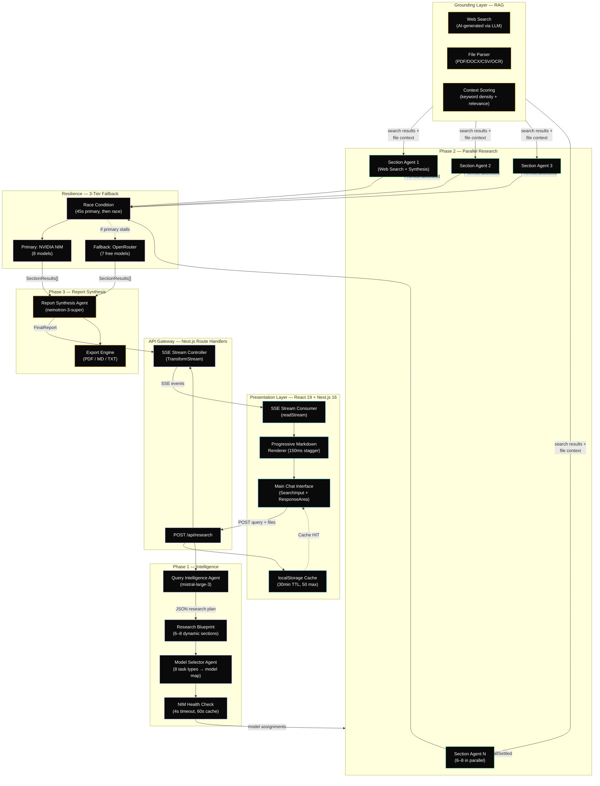

<div align="center">

# ResAgent — Advanced Multi-Agent Research Orchestrator

[](https://nextjs.org/)
[](https://react.dev/)
[](https://www.typescriptlang.org/)
[](https://tailwindcss.com/)
[](https://www.nvidia.com/en-us/ai/)

**Next-Generation Multi-Agent Research Engine**
*Transforming raw queries into exhaustive, structured, and fact-checked intelligence reports using a fleet of 7+ specialized AI experts.*

[Overview](#-project-overview) | [Features](#-key-features) | [Architecture](#-system-architecture) | [Dev Stack](#-development-stack) | [Setup](#-installation--setup) | [Configuration](#-configuration) | [Stats](#-project-stats) | [Usage](#-usage-guide) | [Maintainer](#-maintainer)

</div>

---

## Project Overview

**ResAgent** is a production-grade, multi-agent AI research system built on **Next.js 16** and **React 19**. It orchestrates a fleet of specialized AI agents across a **3-phase pipeline** (Intelligence, Retrieval, Synthesis) to deliver exhaustive, citation-rich research reports in real-time.

> [!IMPORTANT]
> - **Dynamic Model Routing** — each research section is classified into one of 8 task types and routed to the optimal model automatically.
> - **3-Tier Fallback Chains** — every agent has primary, secondary, and tertiary model fallbacks spanning NVIDIA NIM and OpenRouter.
> - **Race-Condition Fallback** — if the primary model stalls, a concurrent OpenRouter request fires simultaneously; first response wins.
> - **Zero-Downtime Resilience** — graceful 150s timeout per agent ensures the report always delivers, even if individual agents fail.

---

## Key Features

### Intelligent Data Retrieval
- **Targeted Augmentation** — concurrent web searches triggered by refined research blueprints, not raw user input.
- **Multi-Modal File Intake** — seamlessly ingest and parse complex local files:
  - **PDF** — high-fidelity text extraction via `pdfjs-dist`
  - **DOCX** — comprehensive Word document processing via `mammoth`
  - **CSV** — structured data handling with `PapaParse`
  - **Images** — WebAssembly-powered OCR text extraction via `Tesseract.js`
  - **TXT / MD / JSON** — direct text parsing
- **Semantic Scoring** — extracted text is chunked and scored against the query using keyword density and relevance proximity.
- **Token Budgeting (70/30 Split)** — context window space prioritizes local file content (70%) over web results (30%) for groundedness.

### Specialized Agent Fleet
The system dynamically assigns models based on task complexity and domain expertise.

| Agent | Purpose | Primary (NVIDIA NIM) | Fallback (OpenRouter) |
| :--- | :--- | :--- | :--- |
| **Query Intelligence** | Refines queries & builds research plans | `mistral-large-3` | `gpt-oss-120b:free` |
| **Web Search** | Concurrent real-time data retrieval | `dracarys-70b` | `llama-3.3-70b:free` |
| **Financial Analysis** | Market trends & fiscal data correlation | `deepseek-v3.2` | `gpt-oss-120b:free` |
| **Deep Reasoning** | Risk assessment & complex logic chains | `kimi-k2-thinking` | `gpt-oss-120b:free` |
| **Code Generation** | Technical snippet & algorithm generation | `qwen3-coder-480b` | `qwen3-coder:free` |
| **Summarization** | High-speed overview generation | `minimax-m2.7` | `glm-4.5-air:free` |
| **Report Synthesis** | Final markdown assembly & quality control | `nemotron-3-super` | `nemotron-3:free` |

### Real-Time Streaming & Transparency
- **Server-Sent Events (SSE)** — real-time streaming of all agent activities, progress, and results.
- **Agent Status Panel** — live progress bar showing each agent's state (`pending` / `running` / `done` / `failed`).
- **Thinking Panel** — collapsible view of AI reasoning steps for full transparency.
- **Progressive Section Reveal** — report sections appear with 150ms staggered animation for a polished UX.

### Export & Persistence
- **Multi-Format Export** — download reports as **PDF**, **Markdown**, or **TXT**.
- **Client-Side Caching** — localStorage cache with 30-minute TTL and 50-entry LRU eviction.
- **History Management** — browse, reload, and delete previous research sessions.

### Design System
- **Glassmorphism UI** — matte black/white theme with glass effects (`.glass`, `.glass-card`, `.glass-strong`).
- **Metallic Gradients** — decorative streak animations and gold glow effects.
- **Typography** — Inter (body), Playfair Display (headings), Geist Mono (code).
- **Responsive** — mobile-optimized with viewport fix and adaptive sidebar.

---

## System Architecture

ResAgent uses a **3-Phase Orchestration Model** managed by a central orchestrator with parallel agent execution.



### Execution Flow

1. **User submits query** → `handleSubmit()` checks localStorage cache; on miss, POSTs to `/api/research`
2. **API Route** creates an SSE stream and calls `runResearchOrchestrator()`
3. **Phase 1 — Intelligence** (5–15% progress):
   - Query Intelligence Agent generates a research plan with 6–8 dynamic sections
   - Model Selector Agent classifies each section into a task type and assigns optimal models
   - NVIDIA NIM health check determines if fallback swap is needed
4. **Phase 2 — Parallel Research** (18–70% progress):
   - All section agents launch concurrently via `Promise.allSettled` (200ms stagger)
   - Each agent: web search → context building → LLM synthesis → JSON parsing
   - 150s graceful timeout per agent; partial results accepted
5. **Phase 3 — Report Synthesis** (80–100% progress):
   - Report Synthesis Agent compiles all section outputs into a structured `FinalReport`
   - Result streamed back to frontend via SSE
6. **Frontend** receives the report, maps sections to `ResponseSection[]`, and reveals them progressively

---

## Development Stack

### Frontend Core
| Technology | Version | Purpose |
| :--- | :--- | :--- |
| **Next.js** | `16.2.4` | App Router, Route Handlers, Turbopack |
| **React** | `19.2.4` | Concurrent rendering, hooks-based state |
| **Tailwind CSS** | `v4` | Utility-first styling |
| **Framer Motion** | `12.38.0` | Page transitions, micro-interactions, staggered reveals |
| **shadcn/ui** | `4.2.0` | Accessible component primitives |
| **Base UI** | `1.4.0` | Headless UI components |
| **Lucide React** | `1.8.0` | Icon library |

### AI & Orchestration
| Technology | Purpose |
| :--- | :--- |
| **NVIDIA NIM** | Primary inference platform (8 models) |
| **OpenRouter** | Fallback inference platform (7 free-tier models) |
| **Server-Sent Events** | Real-time streaming from API to client |

### File Processing
| Library | Version | Purpose |
| :--- | :--- | :--- |
| `pdfjs-dist` | `5.6.205` | PDF text extraction |
| `mammoth` | `1.12.0` | DOCX text extraction |
| `papaparse` | `5.5.3` | CSV parsing |
| `tesseract.js` | `7.0.0` | Image OCR (WebAssembly) |

### Export Engine
| Library | Version | Purpose |
| :--- | :--- | :--- |
| `jspdf` | `4.2.1` | PDF generation |
| `jspdf-autotable` | `5.0.7` | Table generation in PDFs |
| `html-to-image` | `1.11.13` | UI element screenshot capture |

### Markdown Rendering
| Library | Version | Purpose |
| :--- | :--- | :--- |
| `react-markdown` | `10.1.0` | Markdown to React components |
| `remark-gfm` | `4.0.1` | GitHub Flavored Markdown support |

### Utilities
| Library | Purpose |
| :--- | :--- |
| `class-variance-authority` | Component variant management |
| `clsx` | Conditional className joining |
| `tailwind-merge` | Tailwind class deduplication |
| `tw-animate-css` | Extended Tailwind animations |

---

## Installation & Setup

### Prerequisites
- **Node.js** 20+
- **NPM** 10+
- API keys for **NVIDIA NIM** and **OpenRouter**

### 1. Clone the Repository
```bash
git clone https://github.com/girishlade111/research-assistant.git
cd research-assistant
```

### 2. Install Dependencies
```bash
npm install
```

### 3. Configure Environment Variables
Create a `.env.local` file in the project root:

```env
# REQUIRED — Get from https://build.nvidia.com
NVIDIA_API_KEY=nvapi-xxxxxxxxxxxx

# REQUIRED — Get from https://openrouter.ai
OPENROUTER_API_KEY=sk-or-xxxxxxxxxxxx

# OPTIONAL — App URL (defaults to http://localhost:3000)
NEXT_PUBLIC_APP_URL=http://localhost:3000
```

### 4. Start Development Server
```bash
npm run dev
```
Open [http://localhost:3000](http://localhost:3000) in your browser.

### Available Scripts

| Command | Description |
| :--- | :--- |
| `npm run dev` | Start development server with Turbopack |
| `npm run build` | Create production build |
| `npm run start` | Start production server |
| `npm run lint` | Run ESLint |

---

## Configuration

### Token Governance

The system uses a tiered token budgeting strategy based on task priority.

| Parameter | Value | Description |
| :--- | :--- | :--- |
| **Global Context** | `131,072` tokens | Maximum supported context for large document sets |
| **Max Report** | `32,768` tokens | Total budget for the final synthesized report |
| **Per-Agent Cap** | `16,384` tokens | Individual context budget for specialized sub-agents |
| **Per-Section** | `8,192` tokens | Token budget per research section |
| **Agent Timeout** | `150,000 ms` | Maximum duration before graceful failure triggers |
| **Health Check** | `4,000 ms` | Maximum latency for NVIDIA NIM endpoint ping |
| **Search Timeout** | `20,000 ms` | Maximum duration per web search query |
| **Stagger Delay** | `200 ms` | Delay between concurrent agent launches |

### Priority Token Budgets

| Priority Level | Token Budget |
| :--- | :--- |
| **High** | `16,384` tokens |
| **Medium** | `12,288` tokens |
| **Low** | `8,192` tokens |

### Research Modes

| Mode | Sources | Description |
| :--- | :--- | :--- |
| **Corpus** | Document-only | Focuses exclusively on uploaded files; no web search |
| **Deep** | 4 sources | Combines files with targeted web search |
| **Pro** | 8+ sources | Exhaustive research with deep reasoning agents |

### Model Registry

#### NVIDIA NIM (Primary Platform — 8 Models)

| Model ID | Type | Context | Used By |
| :--- | :--- | :--- | :--- |
| `minimaxai/minimax-m2.7` | Fast | 32K | Summarization |
| `moonshotai/kimi-k2-thinking` | Reasoning | 32K | Report, Fact-Check, Risk Analysis |
| `abacusai/dracarys-llama-3.1-70b-instruct` | Balanced | 32K | Web Search, Default |
| `mistralai/mistral-large-3-675b-instruct-2512` | Balanced | 32K | Query Intelligence, Fact-Check |
| `deepseek-ai/deepseek-v3.2` | Reasoning | 32K | Financial, Technical Analysis |
| `z-ai/glm4.7` | Balanced | 32K | Market Research |
| `qwen/qwen3-coder-480b-a35b-instruct` | Coding | 32K | Code Generation |
| `nvidia/nemotron-3-super-120b-a12b` | Balanced | 32K | Report Synthesis |

#### OpenRouter (Fallback Platform — 7 Free Models)

| Model ID | Type | Context | Used By |
| :--- | :--- | :--- | :--- |
| `nvidia/nemotron-3-super-120b-a12b:free` | Balanced | 32K | Report Synthesis fallback |
| `qwen/qwen3-coder:free` | Coding | 32K | Code Generation fallback |
| `meta-llama/llama-3.3-70b-instruct:free` | Balanced | 131K | Web Search, Default fallback |
| `openai/gpt-oss-120b:free` | Reasoning | 32K | Query, Financial, Technical fallback |
| `z-ai/glm-4.5-air:free` | Fast | 32K | Summary fallback |
| `google/gemma-4-31b-it:free` | Fast | 32K | Summary fallback |
| `minimax/minimax-m2.5:free` | Fast | 32K | Summary fallback |

### 3-Tier Fallback Chains

Every agent has a 3-tier fallback chain. If the primary model fails, the system automatically cascades:

```
queryIntelligence:  [nvidia/mistral]      → [nvidia/nemotron]    → [openrouter/gpt-oss]
webSearch:          [nvidia/dracarys]     → [nvidia/glm]        → [openrouter/glm-air]
financialAnalysis:  [nvidia/deepseek]     → [nvidia/kimi]       → [openrouter/gpt-oss]
riskAnalysis:       [nvidia/kimi]         → [nvidia/deepseek]   → [openrouter/gpt-oss]
marketResearch:     [nvidia/glm]          → [nvidia/mistral]    → [openrouter/nemotron]
technicalAnalysis:  [nvidia/deepseek]     → [nvidia/nemotron]   → [openrouter/gpt-oss]
codeGeneration:     [nvidia/qwen]         → [nvidia/deepseek]   → [openrouter/qwen]
factChecking:       [nvidia/kimi]         → [nvidia/mistral]    → [openrouter/gpt-oss]
summarization:      [nvidia/minimax]      → [nvidia/glm]        → [openrouter/glm-air]
reportSynthesis:    [nvidia/nemotron]     → [nvidia/mistral]    → [openrouter/nemotron]
```

> [!NOTE]
> Fallback transitions include a **500ms** delay (tier 1→2) and **1000ms** delay (tier 2→3) to respect rate limits.

---

## Project Stats

| Metric | Value |
| :--- | :--- |
| **Specialized AI Agents** | 7+ (Query Intel, Web Search, Financial, Deep Reasoning, Code Gen, Summarization, Report Synthesis) |
| **Integrated LLMs** | 15+ (8 NVIDIA NIM + 7 OpenRouter free-tier) |
| **Research Tiers** | 3 (Corpus, Deep, Pro) |
| **File Types Supported** | 8 (PDF, DOCX, CSV, TXT, MD, JSON, PNG, JPG) |
| **Task Classification Types** | 8 (web_search, deep_reasoning, code_generation, fast_summary, financial_analysis, report_compilation, fact_checking, balanced_research) |
| **SSE Event Types** | 8 (status, token, result, error, done, agent_status, route_decision, thinking) |
| **Agent Stagger Delay** | 200 ms (prevents rate limiting) |
| **Agent Timeout Ceiling** | 150 seconds (graceful degradation) |
| **Cache TTL** | 30 minutes (50 max entries, LRU eviction) |
| **Real-Time Streaming** | 100% SSE-based for all agent activities |
| **Export Formats** | 3 (PDF, Markdown, TXT) |
| **UI Framework** | Glassmorphism with matte black/white theme |

---

## Usage Guide

### 1. Select Research Mode
- **Corpus** — focuses exclusively on your uploaded files; no web search.
- **Deep** — combines files with targeted web search (4 sources).
- **Pro** — exhaustive research using 8+ sources and deep reasoning agents.

### 2. Toggle Specialized Agents
Customize your pipeline by enabling/disabling specific agents via the **Agent Settings Modal**:
- Enable the **Coding Agent** for technical queries.
- Enable the **Fact-Check Agent** for verification-heavy topics.
- Disable agents you don't need to speed up execution.

### 3. Upload Context Files
Drag and drop or click to upload files that ground the AI in your local data:
- **PDF** reports, papers, or documents
- **DOCX** Word documents
- **CSV** data sheets
- **Images** (PNG/JPG) for OCR text extraction

### 4. Real-Time Tracking
Watch the **Agent Status Panel** as agents progress through three phases:
- **Phase 1** — Intelligence (query analysis, research plan, model selection)
- **Phase 2** — Parallel Research (concurrent section agents with web search + synthesis)
- **Phase 3** — Report Synthesis (final compilation and quality control)

Expand the **Thinking Panel** to see the AI's reasoning steps in real-time.

### 5. Explore Results
- **Response Sections** — report is broken into structured sections with Markdown rendering.
- **Sources Panel** — collapsible view of all cited sources with relevance scores.
- **Key Findings** — highlighted bullet points extracted from each section.
- **Data Points** — structured metrics and data extracted by specialized agents.

### 6. Export Your Report
Download findings in your preferred format:
- **PDF** — professional layout with tables and formatting
- **Markdown** — clean `.md` file ready for documentation
- **TXT** — plain text for maximum compatibility

### 7. Multi-Turn Conversations
Continue the research with follow-up questions. The system maintains conversation history for context-aware responses.

---

## Project Structure

```
research-assistant/
├── app/
│   ├── api/research/route.ts       # POST /api/research — SSE streaming endpoint
│   ├── page.tsx                     # Main chat UI (955 lines)
│   ├── layout.tsx                   # Root layout with fonts + SEO metadata
│   ├── globals.css                  # Design system (glass effects, theme, animations)
│   ├── about-us/                    # Static about page
│   ├── privacy-policy/              # Static privacy policy
│   └── terms-and-conditions/        # Static terms page
├── lib/engine/
│   ├── orchestrator.ts              # 3-phase orchestrator (326 lines)
│   ├── types.ts                     # Complete TypeScript type system (507 lines)
│   ├── config.ts                    # Model registry, API endpoints, token limits
│   ├── config/
│   │   ├── model-config.ts          # Section-level model mapping (143 lines)
│   │   └── fallback-config.ts       # 3-tier fallback chains (106 lines)
│   ├── agents/
│   │   ├── query-intelligence-agent.ts   # Phase 1: query refinement + research plan
│   │   ├── model-selector-agent.ts       # Phase 1: task classification + model assignment
│   │   ├── section-research-agent.ts     # Phase 2: parallel section research (513 lines)
│   │   ├── report-synthesis-agent.ts     # Phase 3: final report compilation
│   │   └── base-agent.ts                 # Shared utilities (callWithFallback, safeParseJSON)
│   ├── providers/
│   │   ├── index.ts                 # Central AI response router
│   │   ├── nvidia.ts                # NVIDIA NIM client with retry
│   │   ├── openrouter.ts            # OpenRouter client with model rotation
│   │   └── fallback-executor.ts     # 3-tier sequential fallback executor
│   ├── search-router.ts             # Search system (AI-generated results)
│   ├── context-builder.ts           # Context assembly with semantic scoring
│   ├── response-normalizer.ts       # Output normalization (304 lines)
│   ├── query-enhancer.ts            # Query expansion + intent detection
│   ├── query-router.ts              # Query complexity classifier
│   ├── file-parser.ts               # Multi-format file parsing
│   ├── errors.ts                    # Error classification with user-facing messages
│   └── debug/api-test.ts            # API connectivity tests (dev only)
├── components/
│   ├── agents/                      # Agent status panel, thinking panel, settings modal
│   ├── export/                      # Export buttons (MD/PDF/TXT)
│   ├── layout/                      # Sidebar with navigation + history
│   ├── profile/                     # User profile modal
│   ├── response/                    # Response renderer, source cards, sources section
│   ├── search/                      # Search input, controls, model selector, modals
│   └── ui/                          # shadcn/ui primitives
├── hooks/
│   ├── use-cache.ts                 # localStorage cache + history management
│   ├── use-debounce.ts              # Generic debounce hook
│   └── use-mobile.ts                # Mobile breakpoint detection
├── .env / .env.local                # Environment variables
├── package.json                     # Dependencies and scripts
├── tsconfig.json                    # TypeScript configuration
├── next.config.ts                   # Next.js configuration
├── postcss.config.mjs               # PostCSS + Tailwind
├── eslint.config.mjs                # ESLint configuration
├── components.json                  # shadcn/ui configuration
├── AGENTS.md                        # Agent Fleet Operations manifesto
├── SECURITY.md                      # Security documentation
└── PROJECT-CONTEXT.md               # Comprehensive system documentation
```

---

## Maintainer

<div align="center">

### **Girish Lade**
**Full-Stack AI Solutions Architect & UI/UX Expert**

*Specializing in high-performance multi-agent systems and immersive AI-driven interfaces.*

<br/>

[](https://ladestack.in)
[](https://www.linkedin.com/in/girish-lade-075bba201/)
[](https://github.com/girishlade111)
[](mailto:girishlade@ladestack.in)

</div>

---

## License
**Private and Proprietary.** Powered by the **Lade Stack** ecosystem. All rights reserved 2026.
