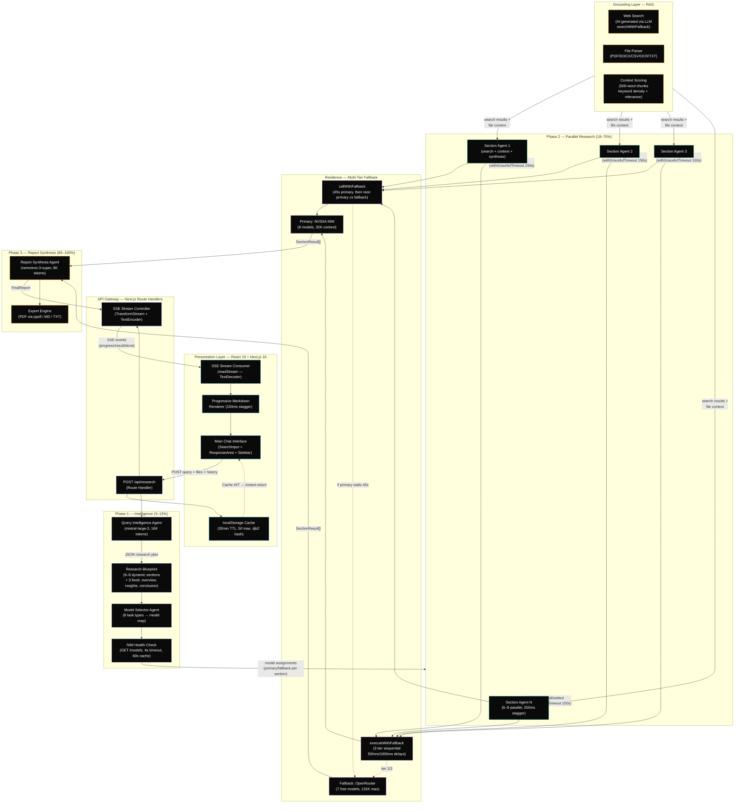

<div align="center">

# ResAgent — Advanced Multi-Agent Research Orchestrator

[](https://nextjs.org/)
[](https://react.dev/)
[](https://www.typescriptlang.org/)
[](https://tailwindcss.com/)
[](https://www.nvidia.com/en-us/ai/)
[](https://research-agent.vercel.app)

**Next-Generation Multi-Agent Research Engine**
*Transforming raw queries into exhaustive, structured, and fact-checked intelligence reports using a fleet of 7+ specialized AI experts operating across a 3-phase orchestration pipeline.*

[Overview](#-project-overview) | [Features](#-key-features) | [Architecture](#-system-architecture) | [Agents](#-agent-deep-dive) | [Dev Stack](#-development-stack) | [Setup](#-installation--setup) | [Configuration](#-configuration) | [API](#-api-reference) | [Types](#-type-system) | [SSE Protocol](#-sse-event-protocol) | [Stats](#-project-stats) | [Usage](#-usage-guide) | [SEO](#-seo--metadata) | [Security](#-security) | [MCP](#-mcp-integration) | [Deployment](#-deployment) | [Maintainer](#-maintainer)

</div>

---

## Project Overview

**ResAgent** is a production-grade, multi-agent AI research system built on **Next.js 16** (App Router) and **React 19** (Concurrent Rendering). It orchestrates a fleet of specialized AI agents across a **3-phase pipeline** — Intelligence, Retrieval, and Synthesis — to deliver exhaustive, citation-rich research reports in real-time via Server-Sent Events.

### What It Does

1. **Accepts** a natural language query (optionally with uploaded files: PDF, DOCX, CSV, images)
2. **Analyzes** the query using a Query Intelligence Agent to build a structured research plan with 6–8 dynamic sections
3. **Classifies** each section into one of 8 task types and assigns the optimal AI model from a registry of 15+ LLMs
4. **Executes** all section research agents in parallel (web search + LLM synthesis per section)
5. **Synthesizes** all section outputs into a structured, citation-rich intelligence report (7–15 pages)
6. **Streams** the entire process to the frontend in real-time via SSE

> [!IMPORTANT]
> **Key Differentiators:**
> - **Dynamic Model Routing** — each research section is classified into one of 8 task types (`web_search`, `deep_reasoning`, `code_generation`, `fast_summary`, `financial_analysis`, `report_compilation`, `fact_checking`, `balanced_research`) and routed to the optimal model automatically.
> - **3-Tier Fallback Chains** — every agent has primary (NVIDIA NIM), secondary (NVIDIA NIM alternate), and tertiary (OpenRouter free-tier) model fallbacks. Zero single points of failure.
> - **Race-Condition Fallback** — if the primary model stalls for 45s, a concurrent OpenRouter request fires simultaneously; first response wins.
> - **Zero-Downtime Resilience** — graceful 150s timeout per agent with partial result acceptance ensures the report always delivers, even if individual agents fail.
> - **Health-Aware Control Plane** — pings NVIDIA NIM health endpoint (4s timeout, 60s cache) before execution. If unhealthy, automatically swaps primary/fallback assignments globally.
> - **Staggered Agent Launch** — agents launch with 200ms delays to prevent API rate limiting while maintaining parallelism.

### How It Differs from a Simple LLM Call

| Aspect | Single LLM | ResAgent |
| :--- | :--- | :--- |
| **Sources** | None (training data only) | Concurrent web search + file parsing |
| **Depth** | Single response | 6–8 specialized sections, each from a domain expert |
| **Models** | One model for everything | Task-specific model routing (8 task types, 15+ models) |
| **Resilience** | Single point of failure | 3-tier fallback chains + race conditions |
| **Transparency** | Black box | Real-time agent status, thinking steps, source citations |
| **Output** | Raw text | Structured report with sections, data points, key findings |

---

## Key Features

### Intelligent Data Retrieval
- **Targeted Augmentation** — concurrent web searches triggered by refined research blueprints, not raw user input. The Query Intelligence Agent generates 3 specific search queries per section.
- **Multi-Modal File Intake** — seamlessly ingest and parse complex local files:
  - **PDF** — high-fidelity text extraction page-by-page via `pdfjs-dist`
  - **DOCX** — comprehensive Word document processing via `mammoth`
  - **CSV** — structured data handling with `PapaParse` (rows joined with commas)
  - **Images (PNG/JPG)** — WebAssembly-powered OCR text extraction via `Tesseract.js` (English)
  - **TXT / MD / JSON** — direct text parsing via `File.text()`
- **Semantic Scoring** — extracted text is chunked (500 words per chunk) and scored against the query using keyword density and relevance proximity.
- **Token Budgeting (70/30 Split)** — context window space prioritizes local file content (70%) over web results (30%) for groundedness in user-provided data.
- **Deduplication** — web search results are deduplicated by URL and capped at 15 sources per section.
- **Drag-and-Drop Upload** — files can be uploaded via drag-and-drop or file picker in the search input.

### Specialized Agent Fleet
The system dynamically assigns models based on task complexity and domain expertise. Each agent has a specific role in the pipeline:

| Agent | Phase | Purpose | Primary (NVIDIA NIM) | Fallback (OpenRouter) | Max Tokens |
| :--- | :--- | :--- | :--- | :--- | :--- |
| **Query Intelligence** | 1 | Refines queries & builds research plans | `mistral-large-3` | `gpt-oss-120b:free` | 16,384 |
| **Model Selector** | 1 | Classifies tasks & assigns optimal models | Static mapping | Health-aware swap | — |
| **Web Search** | 2 | Concurrent real-time data retrieval | `dracarys-70b` | `llama-3.3-70b:free` | 16,384 |
| **Financial Analysis** | 2 | Market trends & fiscal data correlation | `deepseek-v3.2` | `gpt-oss-120b:free` | 16,384 |
| **Deep Reasoning** | 2 | Risk assessment & complex logic chains | `kimi-k2-thinking` | `gpt-oss-120b:free` | 16,384 |
| **Code Generation** | 2 | Technical snippet & algorithm generation | `qwen3-coder-480b` | `qwen3-coder:free` | 32,768 |
| **Summarization** | 2 | High-speed overview generation | `minimax-m2.7` | `glm-4.5-air:free` | 16,384 |
| **Report Synthesis** | 3 | Final markdown assembly & quality control | `nemotron-3-super` | `nemotron-3:free` | 32,768 |

### Real-Time Streaming & Transparency
- **Server-Sent Events (SSE)** — real-time streaming of all agent activities, progress percentages, and results from API to client.
- **Agent Status Panel** — live progress bar showing each agent's state (`pending` / `running` / `done` / `failed` / `skipped`) with model name and provider.
- **Thinking Panel** — collapsible view of AI reasoning steps for full transparency into how the system arrived at its conclusions.
- **Progressive Section Reveal** — report sections appear with 150ms staggered animation for a polished, cinematic UX.
- **Phase Progress Tracking** — 3-phase progress (Intelligence 5–15%, Research 18–70%, Synthesis 80–100%) with status messages.

### Export & Persistence
- **Multi-Format Export** — download reports as:
  - **PDF** — professional layout with tables via `jspdf` + `jspdf-autotable`
  - **Markdown** — clean `.md` file with GitHub Flavored Markdown
  - **TXT** — plain text for maximum compatibility
- **Client-Side Caching** — localStorage cache with **30-minute TTL** and **50-entry LRU** eviction. Hash key generated via djb2-like algorithm with `resagent_cache_` prefix.
- **History Management** — browse, reload, and delete previous research sessions from the sidebar.

### Design System (Glassmorphism)
- **Theme** — Premium matte black (`#0C0C0C`) and white (`#F5F5F5`) with metallic silver accents.
- **Glass Effects** — `.glass` (semi-transparent + blur), `.glass-card` (card-style with border), `.glass-strong` (more opaque for bottom bar).
- **Metallic Gradients** — decorative `.streak-1/2/3` animations, `.gold-glow` effects, `.border-shine` animated highlights.
- **Typography** — Inter (body text), Playfair Display (headings), Geist Mono (code/monospace).
- **Custom Scrollbars** — 6px rounded, semi-transparent white track.
- **Responsive** — mobile-optimized with viewport fix (`visualViewport` API) and adaptive sidebar.
- **Dark Mode** — via `@custom-variant dark (&:is(.dark *))`.

---

## System Architecture

ResAgent uses a **3-Phase Orchestration Model** managed by a central orchestrator (`orchestrator.ts`) with parallel agent execution and multi-tier resilience.



### Detailed Execution Flow

#### Step 1: User Submits Query (`page.tsx` — `handleSubmit()`)
- Creates a user `ChatMessage` with query and uploaded files
- Builds `conversationHistory` from existing messages for multi-turn context
- Checks `localStorage` cache via `getCached()` (djb2 hash of query + mode)
- **Cache HIT** → creates assistant message, reveals sections with 150ms delay → DONE
- **Cache MISS** → creates assistant placeholder, POSTs to `/api/research`

#### Step 2: API Route (`app/api/research/route.ts`)
- Parses request body: `{ query, userId, conversationId, mode }`
- Reads API keys from `process.env` (`NVIDIA_API_KEY`, `OPENROUTER_API_KEY`)
- Validates: returns `503` if no API keys, `400` if no query
- Creates SSE stream via `TransformStream` + `TextEncoder`
- Defines `sendSSE(data)` → writes `data: JSON\n\n` to stream
- Starts background async execution of `runResearchOrchestrator()`
- Returns `Response` with SSE headers (`Content-Type: text/event-stream`, `Cache-Control: no-cache`, `Connection: keep-alive`, `X-Accel-Buffering: no`)

#### Step 3: Phase 1 — Intelligence (`orchestrator.ts`)
- **Cache check** — SHA-256 hash of query + researchMode (currently mocked → always null)
- **Memory fetch** — `buildMemoryContext(userId)` (currently mocked → hardcoded string)
- **Query Intelligence Agent** — sends query to `mistral-large-3` with a "Senior Research Director" system prompt. Expects JSON response with:
  - `queryId`, `originalQuery`, `researchType`, `reportTitle`, `estimatedPages`
  - `fixedSections` (3: overview, keyInsights, conclusion)
  - `dynamicSections` (6–8: each with `agentRole`, `sectionTitle`, `focusArea`, `searchQueries[]`, `priority`, `outputLength`)
  - `globalSearchContext`
- **Model Selector Agent** — classifies each dynamic section into a task type via regex keyword matching, resolves to a model from `SECTION_MODEL_MAP`, runs NVIDIA health check, and returns `AgentModelAssignment[]`

#### Step 4: Phase 2 — Parallel Research
- Each dynamic section gets its own `runSectionAgent()` call
- Agents launch with **200ms stagger** to prevent rate limiting
- Each agent is wrapped in `withGracefulTimeout(launchAgent(), 150_000, section)`
- All execute via `Promise.allSettled(agentPromises)`
- Per section:
  1. `executeSearchQueries()` — runs 3 search queries in parallel (20s timeout each), deduplicates by URL, caps at 15 sources
  2. `buildSearchContext()` — formats sources as text for LLM consumption
  3. `callSynthesisModel()` — builds specialist system prompt, calls LLM via `executeWithFallback()`
  4. `parseAndNormalize()` — extracts JSON from response, normalizes fields
  5. `emitProgress()` — sends progress callback to orchestrator

#### Step 5: Phase 3 — Report Synthesis
- Orders sections by plan order, deduplicates sources
- Builds synthesis prompt with all section content
- Calls `nemotron-3-super` to generate `FinalReport`
- Falls back to raw section assembly if synthesis fails
- Maps `FinalReport` to `ResearchResult` format

#### Step 6: Frontend Receives Result
- `readStream()` parses SSE events, routes by event type
- `onResult` → maps to `ResponseSection[]`, reveals progressively (150ms delay per section)
- Renders via `ResponseArea` with custom Markdown components

---

## Agent Deep Dive

### 1. Query Intelligence Agent (`query-intelligence-agent.ts` — 320 lines)

**Phase:** 1 (Intelligence)
**Purpose:** Transforms raw user queries into structured research blueprints.

**How it works:**
1. Selects model via `selectModel("query", query)` → primary: `mistral-large-3`, fallback: `gpt-oss-120b:free`
2. Builds messages with a "Senior Research Director" system prompt
3. Calls `callWithFallback()` with `jsonMode: true`, `temperature: 0.4`, `maxTokens: 16384`
4. Parses response via `safeParseJSON()` (tries: direct parse → fence extraction → brace block → first/last brace)
5. If parse fails: retries with error correction prompt
6. If still fails: `buildFallbackPlan()` returns 3 simple sections (Background, Analysis, Trends)
7. `normalizeResearchPlan()` validates all fields, ensures minimum 7 estimated pages

**Output:** `{ plan, enhanced_query, subtopics[], search_terms[] }`

**Research types detected:** `financial`, `technical`, `scientific`, `news`, `comparative`, `general`

---

### 2. Model Selector Agent (`model-selector-agent.ts` — 190 lines)

**Phase:** 1 (Intelligence)
**Purpose:** Classifies each research section into a task type and assigns the optimal model.

**How it works:**
1. `detectQueryOverride(query)` — tests query against 4 regex patterns to force specific task types
2. For each dynamic section:
   - `classifySectionTask(section)` — concatenates `agentRole + focusArea + sectionTitle`, tests against `ROLE_KEYWORDS` regex patterns
   - `resolveModelEntry(taskType, queryOverride)` — maps task type → section key → model from `SECTION_MODEL_MAP`
   - `resolveMaxTokens(section, entry)` — uses priority budget (high=16384, medium=12288, low=8192)
3. `checkNvidiaHealth(apiKey)` — pings `GET https://integrate.api.nvidia.com/v1/models` (4s timeout, 60s cache). If unhealthy: swaps primary ↔ fallback for all NVIDIA-primary assignments.

**Output:** `AgentModelAssignment[]` (one per dynamic section)

**Task type classification keywords:**
| Task Type | Keywords |
| :--- | :--- |
| `web_search` | search, find, lookup, retrieve, gather |
| `deep_reasoning` | analyze, assess, evaluate, risk, strategy |
| `code_generation` | code, implement, build, algorithm, function |
| `fast_summary` | summarize, overview, brief, quick |
| `financial_analysis` | financial, revenue, market, fiscal, investment |
| `report_compilation` | report, compile, synthesize, merge |
| `fact_checking` | verify, fact, check, validate, accuracy |
| `balanced_research` | (default fallback) |

---

### 3. Section Research Agent (`section-research-agent.ts` — 513 lines)

**Phase:** 2 (Parallel Research)
**Purpose:** The workhorse. Performs web search + LLM synthesis for each research section.

**Execution steps:**
1. **Web Search** — `executeSearchQueries()` runs 3 search queries in parallel via `searchWithFallback()`. 20s timeout per query. Deduplicates by URL, caps at 15 sources.
2. **Context Building** — `buildSearchContext(sources)` formats sources as `"SOURCE [title] (url):\nsnippet"`.
3. **Synthesis** — `buildSystemPrompt(section, query)` creates a specialist role prompt. Calls `executeWithFallback()` with temperature 0.3, maxTokens 8192.
4. **Parsing** — `parseAndNormalize(raw, section)` extracts JSON, normalizes `keyFindings`, `dataPoints`, `sourcesUsed`, `confidenceScore`, `wordCount`.
5. **Progress** — `emitProgress()` sends status callback.

**Output:** `SectionResult` with content (600–900 words of markdown), key findings, data points, sources, confidence score, metadata.

---

### 4. Report Synthesis Agent (`report-synthesis-agent.ts` — 246 lines)

**Phase:** 3 (Synthesis)
**Purpose:** Compiles all section outputs into a structured, coherent intelligence report.

**How it works:**
1. Orders sections by `plan.dynamicSections` order
2. Deduplicates sources by URL
3. Builds synthesis prompt with all section content, data points, and key findings
4. Calls `generateAIResponse()` with `nemotron-3-super` (primary) or `nemotron-3:free` (fallback)
5. Parses via `safeParseJSON()` to extract `FinalReport`
6. Falls back to raw section assembly if parse fails

**Output:** `FinalReport` with `executiveSummary`, `dynamic[]`, `crossSectionAnalysis`, `keyFindings`, `conclusions`, `confidenceAssessment`

---

### 5. Base Agent Utilities (`base-agent.ts` — 167 lines)

Shared utilities used by all agents:

- **`callWithFallback(agent, primary, fallback, messages, maxTokens, apiKeys, opts)`**
  - Race-based: tries primary for 45s, then races primary vs fallback concurrently
  - First to succeed wins
  - Used by Query Intelligence Agent

- **`safeParseJSON(raw)`**
  - Tries: direct parse → fence extraction (````json...``` ``) → brace block → first/last brace
  - Returns `Record<string, unknown> | null`

- **`skippedResult(agent)`**
  - Returns an `AgentResult` with `error: "skipped"` for disabled agents

---

### 6. Fallback Executor (`fallback-executor.ts` — 163 lines)

3-tier sequential fallback mechanism:

1. Looks up `AGENT_FALLBACK_CHAINS[agentType]`
2. Iterates tiers[0], tiers[1], tiers[2] sequentially
3. **500ms** delay between tier 1→2, **1000ms** between tier 2→3
4. Routes to `nvidiaWithRetry()` or `openrouterWithRetry()` based on platform
5. If all fail: returns `{ content: '', modelUsed: 'none' }` (does NOT throw)

---

## Development Stack

### Frontend Core
| Technology | Version | Purpose | Link |
| :--- | :--- | :--- | :--- |
| **Next.js** | `16.2.4` | App Router, Route Handlers, Turbopack, SSR | [nextjs.org](https://nextjs.org/) |
| **React** | `19.2.4` | Concurrent rendering, hooks-based state | [react.dev](https://react.dev/) |
| **Tailwind CSS** | `v4` | Utility-first CSS framework | [tailwindcss.com](https://tailwindcss.com/) |
| **Framer Motion** | `12.38.0` | Page transitions, micro-interactions, staggered reveals | [framer.com/motion](https://framer.com/motion/) |
| **shadcn/ui** | `4.2.0` | Accessible, composable component primitives | [ui.shadcn.com](https://ui.shadcn.com/) |
| **Base UI** | `1.4.0` | Headless, unstyled UI components | [base-ui.com](https://base-ui.com/) |
| **Lucide React** | `1.8.0` | Beautiful, consistent icon library | [lucide.dev](https://lucide.dev/) |

### AI & Orchestration
| Technology | Purpose | Details |
| :--- | :--- | :--- |
| **NVIDIA NIM** | Primary inference (8 models) | Base URL: `https://integrate.api.nvidia.com/v1`, 90s timeout |
| **OpenRouter** | Fallback inference (7 free models) | Base URL: `https://openrouter.ai/api/v1`, model rotation on 429 |
| **Server-Sent Events** | Real-time streaming | `TransformStream` + `TextEncoder`, `text/event-stream` content type |

### File Processing
| Library | Version | Purpose | Details |
| :--- | :--- | :--- | :--- |
| `pdfjs-dist` | `5.6.205` | PDF text extraction | Page-by-page `getTextContent()` |
| `mammoth` | `1.12.0` | DOCX text extraction | `extractRawText()` |
| `papaparse` | `5.5.3` | CSV parsing | Rows joined with commas |
| `tesseract.js` | `7.0.0` | Image OCR | WebAssembly, English language |

### Export Engine
| Library | Version | Purpose |
| :--- | :--- | :--- |
| `jspdf` | `4.2.1` | Client-side PDF generation |
| `jspdf-autotable` | `5.0.7` | Table generation in PDFs |
| `html-to-image` | `1.11.13` | UI element screenshot capture |

### Markdown Rendering
| Library | Version | Purpose |
| :--- | :--- | :--- |
| `react-markdown` | `10.1.0` | Markdown to React components with custom renderers |
| `remark-gfm` | `4.0.1` | GitHub Flavored Markdown (tables, strikethrough, task lists) |

### Utilities
| Library | Purpose |
| :--- | :--- |
| `class-variance-authority` | Type-safe component variant management |
| `clsx` | Conditional className joining |
| `tailwind-merge` | Intelligent Tailwind class deduplication |
| `tw-animate-css` | Extended Tailwind animation utilities |

### Dev Dependencies
| Tool | Version | Purpose |
| :--- | :--- | :--- |
| **TypeScript** | `^5` | Type safety across the entire codebase |
| **ESLint** | `^9` | Code linting with Next.js + TypeScript config |
| **PostCSS** | `^8.5.12` | CSS processing with Tailwind plugin |
| **@types/react** | `^19` | React type definitions |
| **@types/papaparse** | `^5.5.2` | PapaParse type definitions |

---

## Installation & Setup

### Prerequisites
- **Node.js** 20+ (LTS recommended)
- **NPM** 10+ (or yarn/pnpm equivalent)
- API keys for **NVIDIA NIM** and **OpenRouter**

### 1. Clone the Repository
```bash
git clone https://github.com/girishlade111/research-assistant.git
cd research-assistant
```

### 2. Install Dependencies
```bash
npm install
```

### 3. Configure Environment Variables
Create a `.env.local` file in the project root:

```env
# ═══════════════════════════════════════════════════════════
# REQUIRED — Primary AI Platform
# Get your key from: https://build.nvidia.com
# ═══════════════════════════════════════════════════════════
NVIDIA_API_KEY=nvapi-xxxxxxxxxxxx

# ═══════════════════════════════════════════════════════════
# REQUIRED — Fallback AI Platform
# Get your key from: https://openrouter.ai
# ═══════════════════════════════════════════════════════════
OPENROUTER_API_KEY=sk-or-xxxxxxxxxxxx

# ═══════════════════════════════════════════════════════════
# OPTIONAL — Application URL (defaults to http://localhost:3000)
# ═══════════════════════════════════════════════════════════
NEXT_PUBLIC_APP_URL=http://localhost:3000
```

> [!WARNING]
> Never commit `.env.local` to version control. The `.gitignore` is configured to exclude it. If you accidentally commit a key, **revoke it immediately**.

### 4. Start Development Server
```bash
npm run dev
```
Open [http://localhost:3000](http://localhost:3000) in your browser.

### Available Scripts

| Command | Description | Details |
| :--- | :--- | :--- |
| `npm run dev` | Start development server | Uses Turbopack for fast HMR |
| `npm run build` | Create production build | May show warnings (non-blocking) |
| `npm run start` | Start production server | Serves the built application |
| `npm run lint` | Run ESLint | Next.js + TypeScript rules |

### Getting API Keys

#### NVIDIA NIM
1. Go to [build.nvidia.com](https://build.nvidia.com)
2. Sign up / log in
3. Navigate to API Keys
4. Generate a new key (starts with `nvapi-`)

#### OpenRouter
1. Go to [openrouter.ai](https://openrouter.ai)
2. Sign up / log in
3. Navigate to Keys
4. Create a new key (starts with `sk-or-`)
5. Free-tier models are available without credits

---

## Configuration

### Environment Variables

| Variable | Required | Default | Description |
| :--- | :--- | :--- | :--- |
| `NVIDIA_API_KEY` | Yes | — | NVIDIA NIM API key (`nvapi-...`) |
| `OPENROUTER_API_KEY` | Yes | — | OpenRouter API key (`sk-or-...`) |
| `NEXT_PUBLIC_APP_URL` | No | `http://localhost:3000` | Application base URL |

### Token Governance

The system uses a tiered token budgeting strategy based on task priority.

| Parameter | Value | Description |
| :--- | :--- | :--- |
| **Global Context** | `131,072` tokens | Maximum supported context for large document sets |
| **Max Report** | `32,768` tokens | Total budget for the final synthesized report |
| **Per-Agent Cap** | `16,384` tokens | Individual context budget for specialized sub-agents |
| **Per-Section** | `8,192` tokens | Token budget per research section (LLM call) |
| **Words-to-Tokens Ratio** | `1.3` | Estimation ratio used for token calculations |
| **Agent Timeout** | `150,000 ms` | Maximum duration before graceful failure triggers |
| **Health Check Timeout** | `4,000 ms` | Maximum latency for NVIDIA NIM endpoint ping |
| **Health Check Cache** | `60,000 ms` | How long health check result is cached |
| **Search Timeout** | `20,000 ms` | Maximum duration per web search query |
| **Stagger Delay** | `200 ms` | Delay between concurrent agent launches |
| **Fallback Delay (Tier 1→2)** | `500 ms` | Delay before trying second-tier model |
| **Fallback Delay (Tier 2→3)** | `1,000 ms` | Delay before trying third-tier model |
| **Primary Race Timeout** | `45,000 ms` | How long to wait before racing primary vs fallback |
| **NVIDIA Request Timeout** | `90,000 ms` | HTTP timeout for NVIDIA NIM API calls |
| **NVIDIA Retry** | `1` retry | Exponential backoff (500ms base, 2s max) |
| **OpenRouter 429 Rotation** | `5` models | Rotates through free models on rate limit |

### Priority Token Budgets

| Priority Level | Token Budget | Used For |
| :--- | :--- | :--- |
| **High** | `16,384` tokens | Critical sections (financial, risk, technical) |
| **Medium** | `12,288` tokens | Standard analysis sections |
| **Low** | `8,192` tokens | Summary, overview sections |

### Research Modes

| Mode | Search Queries | Sources | Agent Depth | Description |
| :--- | :--- | :--- | :--- | :--- |
| **Corpus** | 0 | Document-only | Standard | Focuses exclusively on uploaded files; no web search |
| **Deep** | 1 per section | 4 sources | Standard | Combines files with targeted web search |
| **Pro** | 3 per section | 8+ sources | Deep reasoning | Exhaustive research with all agent types |

### Model Registry

#### NVIDIA NIM (Primary Platform — 8 Models)

| Model ID | Type | Context | Cost Priority | Used By |
| :--- | :--- | :--- | :--- | :--- |
| `minimaxai/minimax-m2.7` | Fast | 32K | 1 | Summarization Agent |
| `moonshotai/kimi-k2-thinking` | Reasoning | 32K | 2 | Report, Fact-Check, Risk Analysis |
| `abacusai/dracarys-llama-3.1-70b-instruct` | Balanced | 32K | 2 | Web Search, Default |
| `mistralai/mistral-large-3-675b-instruct-2512` | Balanced | 32K | 3 | Query Intelligence, Fact-Check |
| `deepseek-ai/deepseek-v3.2` | Reasoning | 32K | 3 | Financial, Technical Analysis |
| `z-ai/glm4.7` | Balanced | 32K | 2 | Market Research |
| `qwen/qwen3-coder-480b-a35b-instruct` | Coding | 32K | 3 | Code Generation |
| `nvidia/nemotron-3-super-120b-a12b` | Balanced | 32K | 2 | Report Synthesis |

#### OpenRouter (Fallback Platform — 7 Free Models)

| Model ID | Type | Context | Cost Priority | Used By |
| :--- | :--- | :--- | :--- | :--- |
| `nvidia/nemotron-3-super-120b-a12b:free` | Balanced | 32K | 1 | Report Synthesis fallback |
| `qwen/qwen3-coder:free` | Coding | 32K | 1 | Code Generation fallback |
| `meta-llama/llama-3.3-70b-instruct:free` | Balanced | 131K | 1 | Web Search, Default fallback |
| `openai/gpt-oss-120b:free` | Reasoning | 32K | 1 | Query, Financial, Technical fallback |
| `z-ai/glm-4.5-air:free` | Fast | 32K | 1 | Summary fallback |
| `google/gemma-4-31b-it:free` | Fast | 32K | 1 | Summary fallback |
| `minimax/minimax-m2.5:free` | Fast | 32K | 1 | Summary fallback |

> [!NOTE]
> On OpenRouter 429 (rate limit), the system automatically rotates through 5 free models: `glm-4.5-air`, `gemma-4`, `minimax-m2.5`, `nemotron`, `gpt-oss`.

### Section-Level Model Map

```
queryIntelligence:  primary=nvidia/mistral       fallback=or/gptOss       tokens=16384
webSearch:          primary=nvidia/dracarys       fallback=or/llama        tokens=16384
financialAnalysis:  primary=nvidia/deepseek       fallback=or/gptOss       tokens=16384
marketResearch:     primary=nvidia/glm            fallback=or/nemotron     tokens=16384
riskAnalysis:       primary=nvidia/kimi           fallback=or/gptOss       tokens=16384
technicalAnalysis:  primary=nvidia/deepseek       fallback=or/gptOss       tokens=16384
codeGeneration:     primary=nvidia/qwen           fallback=or/qwen         tokens=32768
factChecking:       primary=nvidia/kimi           fallback=or/gptOss       tokens=16384
summarization:      primary=nvidia/minimax        fallback=or/glmAir       tokens=16384
reportSynthesis:    primary=nvidia/nemotron       fallback=or/nemotron     tokens=32768
```

### 3-Tier Fallback Chains

Every agent has a 3-tier fallback chain. If the primary model fails, the system automatically cascades:

```
queryIntelligence:  [nvidia/mistral]      → [nvidia/nemotron]    → [openrouter/gpt-oss]
webSearch:          [nvidia/dracarys]     → [nvidia/glm]        → [openrouter/glm-air]
financialAnalysis:  [nvidia/deepseek]     → [nvidia/kimi]       → [openrouter/gpt-oss]
riskAnalysis:       [nvidia/kimi]         → [nvidia/deepseek]   → [openrouter/gpt-oss]
marketResearch:     [nvidia/glm]          → [nvidia/mistral]    → [openrouter/nemotron]
technicalAnalysis:  [nvidia/deepseek]     → [nvidia/nemotron]   → [openrouter/gpt-oss]
codeGeneration:     [nvidia/qwen]         → [nvidia/deepseek]   → [openrouter/qwen]
factChecking:       [nvidia/kimi]         → [nvidia/mistral]    → [openrouter/gpt-oss]
summarization:      [nvidia/minimax]      → [nvidia/glm]        → [openrouter/glm-air]
reportSynthesis:    [nvidia/nemotron]     → [nvidia/mistral]    → [openrouter/nemotron]
```

### Cache Configuration

| Parameter | Value | Description |
| :--- | :--- | :--- |
| **Storage** | `localStorage` | Client-side browser storage |
| **TTL** | `30 minutes` | Time-to-live for cached entries |
| **Max Entries** | `50` | LRU eviction when limit reached |
| **Key Prefix** | `resagent_cache_` | Namespace for cache keys |
| **Hash Algorithm** | djb2-like | Hash of query + workflowMode + mode + model |

---

## API Reference

### POST `/api/research`

The only API endpoint. Accepts a research request and returns an SSE stream.

**Request Body:**
```typescript
{
  query: string;              // Required — the research query
  userId?: string;            // Optional — user identifier
  conversationId?: string;    // Optional — conversation identifier
  mode?: "pro" | "deep" | "corpus";  // Research mode (default: "deep")
}
```

**Response:** `text/event-stream` (SSE)

**Headers:**
```
Content-Type: text/event-stream
Cache-Control: no-cache
Connection: keep-alive
X-Accel-Buffering: no
```

**Error Responses:**
| Status | Condition | Body |
| :--- | :--- | :--- |
| `400` | No query provided | `{ error: "Query is required" }` |
| `503` | No API keys configured | `{ error: "API keys not configured" }` |

---

## Type System

The entire type system is defined in `lib/engine/types.ts` (507 lines). Key types:

### Core Types
```typescript
type SearchMode = "pro" | "deep" | "corpus"
type WorkflowMode = "chat" | "planning" | "research"
type IntentType = "coding" | "research" | "comparison" | "explanation" | "factual" | "general"
type ModelProvider = "nvidia" | "openrouter"
type TaskType = "search" | "query" | "analysis" | "coding" | "summary" | "fact-check" | "report" | "default"
type AgentName = "web-search-agent" | "query-intelligence-agent" | "analysis-agent" | "coding-agent" | "summary-agent" | "fact-check-agent" | "report-agent"
type AgentStatus = "pending" | "running" | "done" | "failed" | "skipped"
```

### Section Task Types
```typescript
type SectionTaskType = "web_search" | "deep_reasoning" | "code_generation" |
                       "fast_summary" | "financial_analysis" | "report_compilation" |
                       "fact_checking" | "balanced_research"
```

### Key Interfaces

**`ResearchPlan`** — Output of Query Intelligence Agent:
- `queryId`, `originalQuery`, `researchType`, `reportTitle`, `estimatedPages`
- `fixedSections[]` (3: overview, keyInsights, conclusion)
- `dynamicSections[]` (6–8: each with `agentRole`, `sectionTitle`, `focusArea`, `searchQueries[]`, `priority`, `outputLength`)
- `globalSearchContext`, `totalAgentsNeeded`

**`SectionResult`** — Output per section research agent:
- `sectionId`, `sectionTitle`, `agentRole`, `content` (600–900 words markdown)
- `keyFindings[]`, `dataPoints[]`, `sourcesUsed[]`
- `confidenceScore` (0–1), `dataQuality` ("rich" / "moderate" / "limited")
- `wordCount`, `modelUsed`, `provider`, `isFallback`, `durationMs`, `tokensUsed`

**`FinalReport`** — Output of report synthesis agent:
- `reportId`, `title`, `subtitle`, `generatedAt`, `originalQuery`
- `estimatedReadTime`, `totalWords`, `totalPages`
- `sections: { executiveSummary, dynamic[], crossSectionAnalysis, keyFindings[], conclusions, confidenceAssessment }`
- `sources[]`, `metadata: { totalAgentsUsed, successfulAgents, failedAgents, totalSourcesAnalyzed, modelsUsed[] }`

**`ResearchResult`** — Final API response:
- `overview`, `keyInsights[]`, `details`, `comparison`, `expertInsights[]`, `conclusion`
- `code?`, `factCheck?`
- `sources[]`, `references[]`, `agentResults[]`
- `metadata: { model, provider, searchProvider, intent, tokensUsed, durationMs, isFallback?, agentTrace? }`

---

## SSE Event Protocol

The API streams events to the client using Server-Sent Events format.

### Event Types

| Event | Direction | Data Shape | Description |
| :--- | :--- | :--- | :--- |
| `status` | API → Client | `{ phase, message }` | Phase progress updates |
| `token` | API → Client | `{ text }` | Streaming text chunks |
| `result` | API → Client | `ResearchResult` | Final complete result |
| `error` | API → Client | `{ message }` | Error messages |
| `done` | API → Client | `{}` | Stream completion signal |
| `agent_status` | API → Client | `AgentStatusEvent` | Per-agent state changes |
| `route_decision` | API → Client | `{ complexity, reason }` | Query routing decision |
| `thinking` | API → Client | `ThinkingStep` | AI reasoning steps |

### AgentStatusEvent Shape
```typescript
{
  agent: AgentName;
  status: "pending" | "running" | "done" | "failed" | "skipped";
  model?: string;
  provider?: string;
  durationMs?: number;
  isFallback?: boolean;
  error?: string;
}
```

### ThinkingStep Shape
```typescript
{
  id: string;
  phase: string;
  agent?: AgentName;
  text: string;
  timestamp: number;
}
```

### OrchestratorProgressEvent Shape
```typescript
{
  phase: 1 | 2 | 3;
  type?: "plan_ready" | "models_assigned" | "agent_update" | "phase_complete" | "complete" | "error";
  percent: number;
  status: string;
  sectionId?: string;
  agentRole?: string;
  completedSections?: string[];
  failedSections?: number;
  error?: string;
}
```

---

## Project Stats

| Metric | Value | Details |
| :--- | :--- | :--- |
| **Total TypeScript/TSX Files** | 64 | Across `app/`, `lib/`, `components/`, `hooks/` |
| **Component Files** | 19 | 7 feature groups + UI primitives |
| **Specialized AI Agents** | 7+ | Query Intel, Model Selector, Web Search, Financial, Deep Reasoning, Code Gen, Summarization, Report Synthesis |
| **Integrated LLMs** | 15+ | 8 NVIDIA NIM + 7 OpenRouter free-tier |
| **Research Tiers** | 3 | Corpus, Deep, Pro |
| **File Types Supported** | 8 | PDF, DOCX, CSV, TXT, MD, JSON, PNG, JPG |
| **Task Classification Types** | 8 | web_search, deep_reasoning, code_generation, fast_summary, financial_analysis, report_compilation, fact_checking, balanced_research |
| **SSE Event Types** | 8 | status, token, result, error, done, agent_status, route_decision, thinking |
| **Intent Types** | 6 | coding, research, comparison, explanation, factual, general |
| **Research Types** | 6 | financial, technical, scientific, news, comparative, general |
| **Agent Stagger Delay** | 200 ms | Prevents rate limiting during parallel launch |
| **Agent Timeout Ceiling** | 150 seconds | Graceful degradation with partial results |
| **Primary Race Timeout** | 45 seconds | Before concurrent fallback fires |
| **Cache TTL** | 30 minutes | 50 max entries, LRU eviction |
| **Real-Time Streaming** | 100% | SSE-based for all agent activities |
| **Export Formats** | 3 | PDF, Markdown, TXT |
| **Design System** | Glassmorphism | Matte black/white with metallic accents |
| **Orchestrator Lines** | 326 | `lib/engine/orchestrator.ts` |
| **Type System Lines** | 507 | `lib/engine/types.ts` |
| **Main UI Lines** | 955 | `app/page.tsx` |
| **Section Agent Lines** | 513 | `lib/engine/agents/section-research-agent.ts` |

---

## Usage Guide

### 1. Select Research Mode
Choose the depth of research from the **Search Controls** panel:
- **Corpus** — focuses exclusively on your uploaded files; no web search. Best for document analysis.
- **Deep** — combines files with targeted web search (4 sources per section). Balanced speed and depth.
- **Pro** — exhaustive research using 8+ sources and deep reasoning agents. Most comprehensive but slowest.

### 2. Toggle Specialized Agents
Customize your pipeline by enabling/disabling specific agents via the **Agent Settings Modal**:
- Enable the **Coding Agent** for technical queries requiring code snippets.
- Enable the **Fact-Check Agent** for verification-heavy topics.
- Disable agents you don't need to speed up execution and reduce token usage.

### 3. Upload Context Files
Drag and drop or click to upload files that ground the AI in your local data:
- **PDF** reports, research papers, or documents
- **DOCX** Word documents
- **CSV** data sheets and spreadsheets
- **Images** (PNG/JPG) for OCR text extraction
- **TXT / MD / JSON** plain text files

> [!TIP]
> Files are parsed locally (no server upload for parsing). PDF extraction uses `pdfjs-dist`, OCR uses WebAssembly-powered `tesseract.js`.

### 4. Real-Time Tracking
Watch the **Agent Status Panel** as agents progress through three phases:
- **Phase 1 — Intelligence** (5–15%): query analysis, research plan generation, model selection
- **Phase 2 — Parallel Research** (18–70%): concurrent section agents with web search + LLM synthesis
- **Phase 3 — Report Synthesis** (80–100%): final compilation and quality control

Expand the **Thinking Panel** to see the AI's reasoning steps in real-time.

### 5. Explore Results
- **Response Sections** — report is broken into structured sections with full Markdown rendering (headings, lists, code blocks, tables, emphasis).
- **Sources Panel** — collapsible view of all cited sources with relevance scores.
- **Key Findings** — highlighted bullet points extracted from each section.
- **Data Points** — structured metrics and data extracted by specialized agents.
- **Confidence Score** — per-section confidence indicator (0–1 scale).

### 6. Export Your Report
Download findings in your preferred format:
- **PDF** — professional layout with tables and formatting via `jspdf`
- **Markdown** — clean `.md` file with GitHub Flavored Markdown syntax
- **TXT** — plain text for maximum compatibility

### 7. Multi-Turn Conversations
Continue the research with follow-up questions. The system maintains conversation history for context-aware responses. Previous messages are included in the API request for continuity.

### 8. History Management
Access previous research sessions from the **Sidebar**:
- Browse past queries with timestamps
- Reload any previous session instantly
- Delete individual entries or clear all history

---

## SEO & Metadata

ResAgent includes comprehensive SEO configuration in `app/layout.tsx`:

### Meta Tags
- **Title Template:** `"%s | ResAgent"` with default `"ResAgent — AI Research Assistant"`
- **Description:** Multi-agent AI research engine producing fact-checked intelligence reports
- **Keywords:** 15 targeted terms (AI research assistant, multi-agent AI, NVIDIA NIM, OpenRouter, etc.)
- **Author/Creator:** Girish Lade / Lade Stack
- **Robots:** `index: true, follow: true` with Googlebot max-image-preview: large

### Open Graph
- **Type:** website
- **Locale:** en_US
- **Site Name:** ResAgent
- **Image:** `/og-image.png` (1200x630)
- **URL:** `https://research-agent.vercel.app`

### Twitter Cards
- **Card Type:** `summary_large_image`
- **Handle:** `@girish_lade_`

### Structured Data (JSON-LD)
```json
{
  "@type": "SoftwareApplication",
  "name": "ResAgent",
  "applicationCategory": "BusinessApplication",
  "operatingSystem": "Any",
  "offers": { "@type": "Offer", "price": "0", "priceCurrency": "USD" }
}
```

### Viewport
- `width: device-width`, `initial-scale: 1`, `maximum-scale: 5`
- Theme colors: `#ffffff` (light), `#0a0a0a` (dark)

---

## Security

### Supported Versions
| Version | Supported |
| :--- | :--- |
| `0.1.x` | Yes |
| `< 0.1` | No |

### API Key Management
- **Environment Variables Only** — never hardcode API keys. Always use `.env.local` or secure CI/CD secrets.
- **Git Protection** — `.gitignore` excludes environment files. If a key is accidentally committed, **revoke it immediately**.
- **Secret Masking** — logs and SSE streams are designed to never leak raw API keys or sensitive credentials.

### Data Privacy
- **Local Processing** — document parsing (PDF, DOCX, OCR) is performed locally or via WebAssembly to minimize data transit.
- **No Server Persistence** — by default, ResAgent does not store uploaded documents or search history server-side.
- **Client-Side Only** — caching and history use `localStorage` only.

### Vulnerability Reporting
Do **not** open a public issue. Instead:
1. Email [girishlade@ladestack.in](mailto:girishlade@ladestack.in) with subject `SECURITY VULNERABILITY - [Description]`
2. Include detailed description, reproduction steps, and potential impact
3. Expect acknowledgment within **48 hours**, updates every **3–5 days**
4. Responsible disclosure: give reasonable time before public disclosure

### Developer Security Practices
- Run `npm audit` regularly to identify vulnerable packages
- Keep dependencies updated via `npm update`
- Sanitize all input before passing to LLM prompts (prevent prompt injection)

---

## MCP Integration

ResAgent supports Model Context Protocol (MCP) servers for extended capabilities. Key supported servers:

| Category | Servers |
| :--- | :--- |
| **File System** | `filesystem`, `git` |
| **Web** | `fetch`, `brave-search`, `google-search`, `puppeteer`, `playwright` |
| **Cloud** | `aws`, `azure`, `gcloud`, `cloudflare-ai` |
| **Databases** | `postgres`, `sqlite`, `mongodb`, `supabase`, `firebase` |
| **DevOps** | `docker`, `kubernetes`, `github-actions`, `vercel`, `netlify`, `railway` |
| **Communication** | `slack`, `discord`, `teams`, `outlook`, `gmail` |
| **Productivity** | `notion`, `linear`, `todoist`, `jira`, `confluence` |
| **AI/ML** | `openai`, `ollama`, `claude-api`, `lmstudio`, `groq`, `huggingface`, `replicate` |
| **Research** | `arxiv`, `semantic-scholar`, `academic-search`, `pubmed` |

---

## Deployment

### Vercel (Recommended)

ResAgent is deployed at [research-agent.vercel.app](https://research-agent.vercel.app).

1. Push your repository to GitHub
2. Import the project in [Vercel Dashboard](https://vercel.com/dashboard)
3. Set environment variables (`NVIDIA_API_KEY`, `OPENROUTER_API_KEY`)
4. Deploy — Vercel auto-detects Next.js and configures build settings

### Production Build
```bash
npm run build    # Create optimized production build
npm run start    # Start production server on port 3000
```

### Environment Variables for Production
Ensure these are set in your deployment platform:
- `NVIDIA_API_KEY` — NVIDIA NIM API key
- `OPENROUTER_API_KEY` — OpenRouter API key
- `NEXT_PUBLIC_APP_URL` — Your production URL (e.g., `https://research-agent.vercel.app`)

---

## Project Structure

```
research-assistant/
├── app/                                          # Next.js App Router directory
│   ├── api/
│   │   └── research/
│   │       └── route.ts                          # POST /api/research — SSE streaming endpoint
│   ├── page.tsx                                   # Main chat UI (955 lines)
│   │                                              #   - handleSubmit(), readStream(), revealSections()
│   │                                              #   - Multi-turn conversation management
│   │                                              #   - Cache check before API call
│   │                                              #   - Export handler (MD/PDF/TXT)
│   │                                              #   - Mobile viewport fix
│   ├── layout.tsx                                 # Root layout
│   │                                              #   - Fonts: Inter, Playfair_Display, Geist_Mono
│   │                                              #   - SEO metadata (OpenGraph, Twitter Cards)
│   │                                              #   - JSON-LD structured data
│   ├── globals.css                                # Design system
│   │                                              #   - Matte black/white theme tokens
│   │                                              #   - Glass effects (.glass, .glass-card, .glass-strong)
│   │                                              #   - Metallic gradients, streak decorations
│   │                                              #   - Custom scrollbars, animations
│   ├── icon.svg / icon.tsx                        # App icons
│   ├── about-us/page.tsx                          # About page (static)
│   ├── privacy-policy/page.tsx                    # Privacy policy (static)
│   └── terms-and-conditions/page.tsx              # Terms (static)
│
├── lib/engine/                                    # CORE ENGINE — all AI logic
│   ├── orchestrator.ts                            # 3-phase orchestrator (326 lines)
│   │                                              #   - runResearchOrchestrator(input) → ResearchResult
│   │                                              #   - Phase 1: Cache → Memory → Query Intel → Model Select
│   │                                              #   - Phase 2: Promise.allSettled(runSectionAgent[])
│   │                                              #   - Phase 3: Report Synthesis → Save → Return
│   │                                              #   - withGracefulTimeout (150s per section)
│   │                                              #   - Staggered agent launch (200ms delay)
│   │
│   ├── types.ts                                   # Complete TypeScript type system (507 lines)
│   ├── config.ts                                  # Core configuration (233 lines)
│   │                                              #   - API endpoints, retry config, token limits
│   │                                              #   - MODEL_REGISTRY (8 NVIDIA + 7 OpenRouter)
│   │                                              #   - AGENT_MODEL_MAP, MODE_CONFIG
│   │
│   ├── config/
│   │   ├── model-config.ts                        # Section-level model mapping (143 lines)
│   │   │                                          #   - SECTION_MODEL_MAP (10 roles → primary/fallback/tokens)
│   │   │                                          #   - TASK_TYPE_TO_SECTION (8 task types → section keys)
│   │   │                                          #   - PRIORITY_TOKEN_BUDGET, QUERY_OVERRIDE_RULES
│   │   └── fallback-config.ts                     # 3-tier fallback chains (106 lines)
│   │                                              #   - AGENT_FALLBACK_CHAINS (10 chains, 3 tiers each)
│   │                                              #   - RETRYABLE_ERRORS: [429, 500, 502, 503, 504]
│   │                                              #   - FATAL_ERRORS: [400]
│   │
│   ├── agents/
│   │   ├── query-intelligence-agent.ts            # Phase 1: query refinement + research plan (320 lines)
│   │   ├── model-selector-agent.ts                # Phase 1: task classification + model assignment (190 lines)
│   │   ├── section-research-agent.ts              # Phase 2: parallel section research (513 lines)
│   │   ├── report-synthesis-agent.ts              # Phase 3: final report compilation (246 lines)
│   │   ├── base-agent.ts                          # Shared utilities (167 lines)
│   │   │                                          #   - callWithFallback(), safeParseJSON(), skippedResult()
│   │   ├── web-search-agent.ts                    # Legacy (unused by current orchestrator)
│   │   ├── analysis-agent.ts                      # Legacy (unused)
│   │   ├── coding-agent.ts                        # Legacy (unused)
│   │   ├── fact-check-agent.ts                    # Legacy (unused)
│   │   ├── summary-agent.ts                       # Legacy (unused)
│   │   └── report-agent.ts                        # Legacy (unused)
│   │
│   ├── providers/
│   │   ├── index.ts                               # Central AI response router (52 lines)
│   │   │                                          #   - generateAIResponse() → routes to nvidia or openrouter
│   │   ├── nvidia.ts                              # NVIDIA NIM client with retry (229 lines)
│   │   │                                          #   - nvidiaComplete(), nvidiaStream(), nvidiaWithRetry()
│   │   │                                          #   - Base URL: integrate.api.nvidia.com/v1, 90s timeout
│   │   ├── openrouter.ts                          # OpenRouter client with model rotation (277 lines)
│   │   │                                          #   - openrouterComplete(), openrouterStream()
│   │   │                                          #   - 429 rotation through 5 free models
│   │   └── fallback-executor.ts                   # 3-tier sequential fallback (163 lines)
│   │                                              #   - executeWithFallback(), callModelByPlatform()
│   │
│   ├── search-router.ts                           # Search system (191 lines)
│   │                                              #   - AI-generated results (not real web search)
│   │                                              #   - searchWithFallback() → nvidia then openrouter
│   ├── context-builder.ts                         # Context assembly with semantic scoring (172 lines)
│   │                                              #   - 500-word chunks, keyword density scoring
│   │                                              #   - 70/30 token budget split (files/web)
│   ├── response-normalizer.ts                     # Output normalization (304 lines)
│   │                                              #   - normalizeResponse() → ResearchResult
│   │                                              #   - toResponseSections() → UI sections
│   │                                              #   - toExportMarkdown() → export-ready markdown
│   ├── query-enhancer.ts                          # Query expansion + intent detection (133 lines)
│   ├── query-router.ts                            # Query complexity classifier (180 lines)
│   │                                              #   - Heuristic + AI-based classification
│   │                                              #   - "simple" vs "research" routing
│   ├── file-parser.ts                             # Multi-format file parsing (101 lines)
│   │                                              #   - PDF, DOCX, CSV, TXT, MD, JSON, PNG, JPG
│   ├── planning-workflow.ts                       # Planning mode (308 lines, not connected)
│   ├── errors.ts                                  # Error classification (102 lines)
│   │                                              #   - ResearchError class with ErrorKind
│   │                                              #   - classifyError(), userFacingMessage()
│   ├── model-router.ts                            # Model selection helpers (78 lines)
│   └── debug/api-test.ts                          # API connectivity tests (158 lines, dev only)
│
├── lib/export/
│   ├── pdf-exporter.ts                            # Advanced PDF export (not used by UI)
│   └── export-pdf.ts                              # Simple PDF export (used by UI)
│
├── components/
│   ├── agents/
│   │   ├── agent-status-panel.tsx                 # Real-time agent pipeline status with progress bar
│   │   ├── thinking-panel.tsx                     # AI thinking steps display (collapsible)
│   │   └── agent-settings-modal.tsx               # Enable/disable individual agents
│   ├── export/
│   │   └── export-buttons.tsx                     # Export to MD/PDF/TXT buttons
│   ├── layout/
│   │   └── sidebar.tsx                            # Navigation sidebar with history management
│   ├── profile/
│   │   └── profile-modal.tsx                      # User profile modal
│   ├── response/
│   │   ├── response-area.tsx                      # Main response renderer (371 lines)
│   │   │                                          #   - Custom markdown components (h1-h6, code, table)
│   │   │                                          #   - CodeBlock with copy button
│   │   │                                          #   - FactCheckBlock with reliability indicators
│   │   │                                          #   - Progressive animation (150ms per section)
│   │   ├── source-card.tsx                        # Individual source card
│   │   ├── source-modal.tsx                       # Source detail modal
│   │   └── sources-section.tsx                    # Collapsible sources panel
│   ├── search/
│   │   ├── search-input.tsx                       # Textarea with file upload, drag-and-drop
│   │   ├── search-controls.tsx                    # Workflow mode, model selector, agent settings
│   │   ├── model-selector.tsx                     # Model picker dropdown
│   │   ├── quick-search-modal.tsx                 # Quick search modal
│   │   └── citation-graph-modal.tsx               # Citation graph visualization
│   └── ui/                                        # shadcn/ui primitives
│       ├── button.tsx
│       ├── collapsible.tsx
│       ├── dialog.tsx
│       └── dropdown-menu.tsx
│
├── hooks/
│   ├── use-cache.ts                               # localStorage cache + history (145 lines)
│   │                                              #   - getCached(), setCached(), getHistory()
│   │                                              #   - 30min TTL, 50 max entries, djb2 hash
│   ├── use-debounce.ts                            # Generic debounce hook
│   └── use-mobile.ts                              # Mobile breakpoint detection (768px)
│
├── .env                                           # Environment variables
├── .env.local                                     # Local overrides (gitignored)
├── .env.example                                   # Example env file
├── package.json                                   # Dependencies and scripts
├── tsconfig.json                                  # TypeScript configuration
├── next.config.ts                                 # Next.js configuration
├── postcss.config.mjs                             # PostCSS + Tailwind plugin
├── eslint.config.mjs                              # ESLint configuration
├── components.json                                # shadcn/ui configuration
├── AGENTS.md                                      # Agent Fleet Operations manifesto
├── CLAUDE.md                                      # Project guide for AI assistants
├── SKILLS.md                                      # Agent capabilities documentation
├── SECURITY.md                                    # Security policy
├── PROJECT-CONTEXT.md                             # Comprehensive system documentation
└── README.md                                      # This file
```

---

## Maintainer

<div align="center">

### **Girish Lade**
**Full-Stack AI Solutions Architect & UI/UX Expert**

*Specializing in high-performance multi-agent systems and immersive AI-driven interfaces.*

<br/>

[](https://ladestack.in)
[](https://www.linkedin.com/in/girish-lade-075bba201/)
[](https://github.com/girishlade111)
[](mailto:girishlade@ladestack.in)

</div>

---

## License
**Private and Proprietary.** Powered by the **Lade Stack** ecosystem. All rights reserved 2026.
