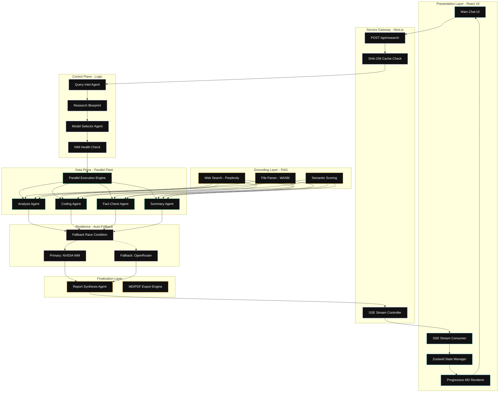

<div align="center">

# 🔬 ResAgent — Advanced Multi-Agent Research Orchestrator

[](https://nextjs.org/)
[](https://react.dev/)
[](https://www.typescriptlang.org/)
[](https://tailwindcss.com/)
[](https://www.nvidia.com/en-us/ai/)

**Next-Generation Multi-Agent Research Engine**  
*Transforming raw queries into exhaustive, structured, and fact-checked intelligence reports using a fleet of specialized AI experts.*

[Project Overview](#-project-overview) • [Key Features](#-key-features) • [System Architecture](#-system-architecture) • [Dev Stack](#-development-stack) • [Installation](#-installation--setup) • [Configuration](#-configuration) • [Project Stats](#-project-stats--metrics) • [Usage Guide](#-usage-guide) • [Maintainer](#-maintainer)

</div>

---

## 📋 Project Overview

**ResAgent** is a production-grade, multi-agent AI research system engineered for **depth**, **accuracy**, and **scale**. It orchestrates a **fleet of specialized AI agents** across a multi-phase pipeline to deliver exhaustive, citation-rich research reports in real-time.

> [!IMPORTANT]
> **ResAgent** features **Dynamic Model Routing** with automatic fallback to high-capacity context models (up to **131,072 tokens**). A unique race-condition fallback mechanism ensures zero downtime by firing concurrent requests to OpenRouter if primary endpoints stall.

---

## ✨ Key Features

### 🌐 Intelligent Data Retrieval
*   **Targeted Augmentation:** Concurrent web searches triggered by refined research blueprints rather than raw user input.
*   **Multi-Modal Intake:** Seamlessly ingest and parse complex local files:
    *   **PDF Parsing:** High-fidelity text extraction via `pdfjs-dist`.
    *   **Word Documents:** Comprehensive DOCX processing via `mammoth`.
    *   **Structured Data:** CSV and datasheet handling with `PapaParse`.
    *   **Image OCR:** WebAssembly-powered text extraction from images via `Tesseract.js`.

### 🤖 Specialized Agent Fleet
The system dynamically assigns models based on task complexity and domain expertise.

| Agent | Purpose | Primary Model (NVIDIA NIM) | Fallback (OpenRouter) |
| :--- | :--- | :--- | :--- |
| **Query Intelligence** | Refines queries & builds research plans | `mistral-large-3` | `gpt-oss-120b:free` |
| **Web Search** | Concurrent real-time data retrieval | `dracarys-70b` | `llama-3.3-70b:free` |
| **Financial Analysis** | Market trends & fiscal data correlation | `deepseek-v3.2` | `gpt-oss-120b:free` |
| **Deep Reasoning** | Risk assessment & complex logic | `kimi-k2-thinking` | `gpt-oss-120b:free` |
| **Code Generation** | Technical snippet & algorithm generation | `qwen3-coder-480b` | `qwen3-coder:free` |
| **Summarization** | High-speed overview generation | `minimax-m2.7` | `glm-4.5-air:free` |
| **Report Synthesis** | Final markdown assembly & QC | `nemotron-3-super` | `nemotron-3:free` |

---

## 🏗️ System Architecture

ResAgent utilizes a sophisticated **Control Plane vs. Data Plane** architecture to manage high-concurrency multi-agent workflows.

### 🧩 Granular Orchestration Workflow



---

### 🛡️ Technical Deep Dives

#### 1. The Model Routing & Health Plane
Unlike static LLM implementations, ResAgent employs a **Health-Aware Control Plane** (`model-selector-agent.ts`):
*   **Dynamic Task Classification:** Every research section is classified into 8 specialized task types (e.g., `web_search`, `financial_analysis`, `deep_reasoning`).
*   **Pre-emptive Health Checks:** The system pings the **NVIDIA NIM health endpoint** with a 4s timeout. If latency exceeds this threshold or the service returns a non-200 status, the Control Plane automatically swaps primary assignments to OpenRouter fallbacks *before* execution begins.

#### 2. Resilient Parallelization Framework
The engine leverages Node.js asynchronous primitives and `Promise.allSettled` to manage the agent fleet:
*   **Non-Blocking Aggregation:** Web searching and local document parsing run concurrently. Document parsing is handled via **WebAssembly (WASM)** threads, offloading CPU-intensive OCR tasks from the main event loop.
*   **Graceful Degradation:** Each agent is wrapped in a `withGracefulTimeout` wrapper. If a sub-agent stalls (150s ceiling), the system returns a partial result with a clear "Data Limitations" notice, ensuring the final report is delivered even if one "expert" fails.

#### 3. WASM-Powered Grounding Layer (RAG)
To ensure zero hallucinations, the system uses a **Semantic Blackboard Architecture** (`context-builder.ts`):
*   **Semantic Scoring:** Text extracted from files and web results is chunked and scored against the research query using keyword density and relevance proximity.
*   **Token Budgeting (70/30 Split):** The system intelligently allocates context window space, prioritizing local file content (70% budget) over web search results (30% budget) to ensure groundedness in user-provided data.

---

## 🛠️ Development Stack

### Frontend Core
- **Framework:** **Next.js 16.2.4** (App Router, Turbopack)
- **Library:** **React 19.2.4** (Concurrent Rendering)
- **Styling:** **Tailwind CSS v4** + `tw-animate-css`
- **Animations:** **Framer Motion 12.38.0**
- **Components:** **shadcn/ui** + **Base UI 1.4.0**
- **State Management:** **Zustand** (Local UI state)

### AI & Orchestration
- **Inference:** **NVIDIA NIM** (Primary), **OpenRouter** (Fallback)
- **Web Search:** **Perplexity Sonar API**
- **Data Parsing:**
    - **PDF:** `pdfjs-dist` (High-fidelity extraction)
    - **DOCX:** `Mammoth` (Semantic HTML conversion)
    - **CSV:** `PapaParse` (Stream parsing)
    - **Images:** `Tesseract.js` (WASM OCR)
- **Streaming:** Native **Server-Sent Events (SSE)** for real-time progress.

### Export Engine
- **PDF Export:** `jspdf` + `jspdf-autotable`
- **Visuals:** `html-to-image` for capturing UI elements.

---

## 🚀 Installation & Setup

### 1. Prerequisites
- **Node.js 20+**
- **NPM 10+**
- API Keys for **NVIDIA NIM**, **OpenRouter**, and **Perplexity**.

### 2. Clone & Install
```bash
git clone https://github.com/girishlade111/research-assistant.git
cd research-assistant
npm install
```

### 3. Configure Environment
Create a `.env.local` in the root and add your keys:
```env
# Primary platform (NVIDIA NIM)
NVIDIA_API_KEY=nvapi-your-key-here

# Fallback platform (OpenRouter)
OPENROUTER_API_KEY=sk-or-your-key-here

# Web Search (Perplexity)
SONAR_API_KEY=pplx-your-key-here
```

### 4. Launch Development
```bash
npm run dev
# Open http://localhost:3000 to see the application.
```

---

## ⚙️ Configuration & Stats

### Token Governance
The system uses a tiered token budgeting strategy based on task priority.

| Parameter | Value | Description |
| :--- | :--- | :--- |
| **Global Context** | **131,072** | Maximum supported context for massive document sets. |
| **Max Response** | **32,768** | Total budget for the final synthesized report. |
| **Per-Agent Cap** | **16,384** | Individual context budget for specialized sub-agents. |
| **Agent Timeout** | **150,000ms** | Maximum duration before a sub-agent triggers graceful failure. |
| **Health Check** | **4,000ms** | Maximum latency allowed for primary NVIDIA NIM endpoints. |

### Project Metrics
- **8+** Specialized AI Agents working in parallel.
- **15+** State-of-the-art LLMs integrated into the model registry.
- **3** Research Tiers: **Corpus** (Document-only), **Deep** (4 sources), **Pro** (8+ sources).
- **4** File Types Supported: **PDF, DOCX, CSV, Image (OCR)**.
- **0.2s** Stagger delay for concurrent agent launches to prevent rate limiting.
- **100%** SSE-based real-time streaming for all agent activities.

---

## 📖 Usage Guide

1.  **Select Research Mode:**
    - **Corpus:** Focuses exclusively on your uploaded files.
    - **Deep:** Combines files with targeted web search (4 sources).
    - **Pro:** Exhaustive research using 8+ sources and deep reasoning agents.
2.  **Toggle Specialized Agents:** Customize your pipeline by enabling/disabling specific agents (e.g., enable *Coding Agent* for technical queries).
3.  **Context Injection:** Upload PDFs, DOCX, or Images to ground the AI in your local data.
4.  **Real-Time Tracking:** Watch the **Thinking Panel** as agents progress through *Initialization*, *Research*, and *Synthesis*.
5.  **Interactive Exploration:** Use the **Citation Graph** to visualize the connections between findings and sources.
6.  **High-Fidelity Export:** Download your findings as professional **PDF** or **Markdown** reports.

---

## 👤 Maintainer

<div align="center">

### **Girish Lade**
**Full-Stack AI Solutions Architect & UI/UX Expert**

*Specializing in high-performance multi-agent systems and immersive AI-driven interfaces.*

<br/>

[](https://ladestack.in)
[](https://www.linkedin.com/in/girish-lade-075bba201/)
[](https://github.com/girishlade111)
[](mailto:girishlade@ladestack.in)

</div>

---

## 📄 License
**Private and Proprietary.** Powered by the **Lade Stack** ecosystem. All rights reserved © 2026.
