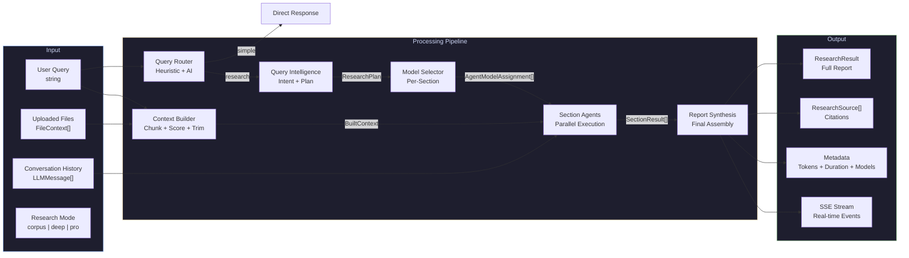
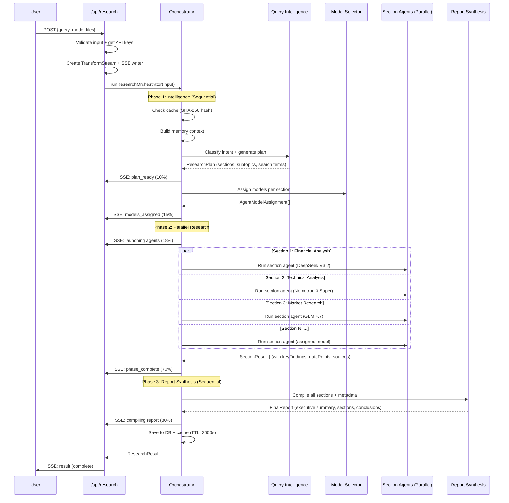
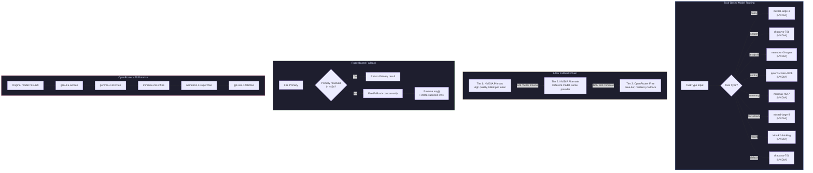
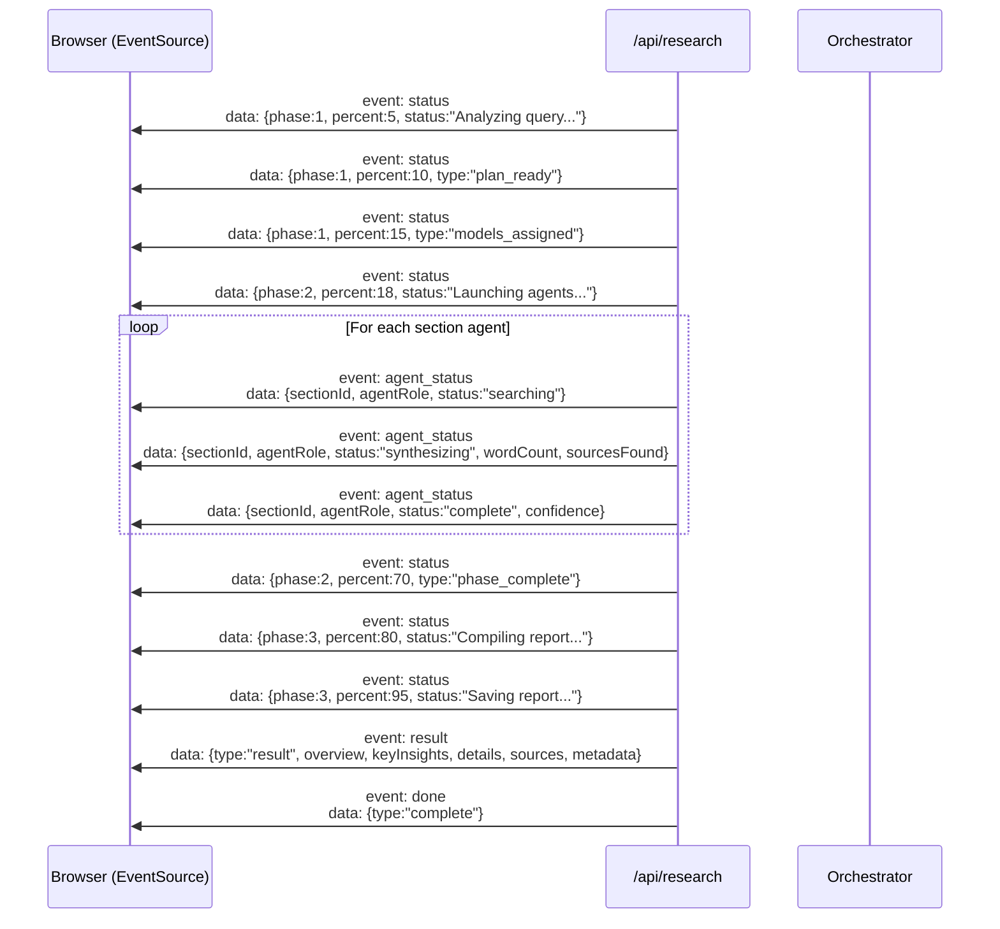
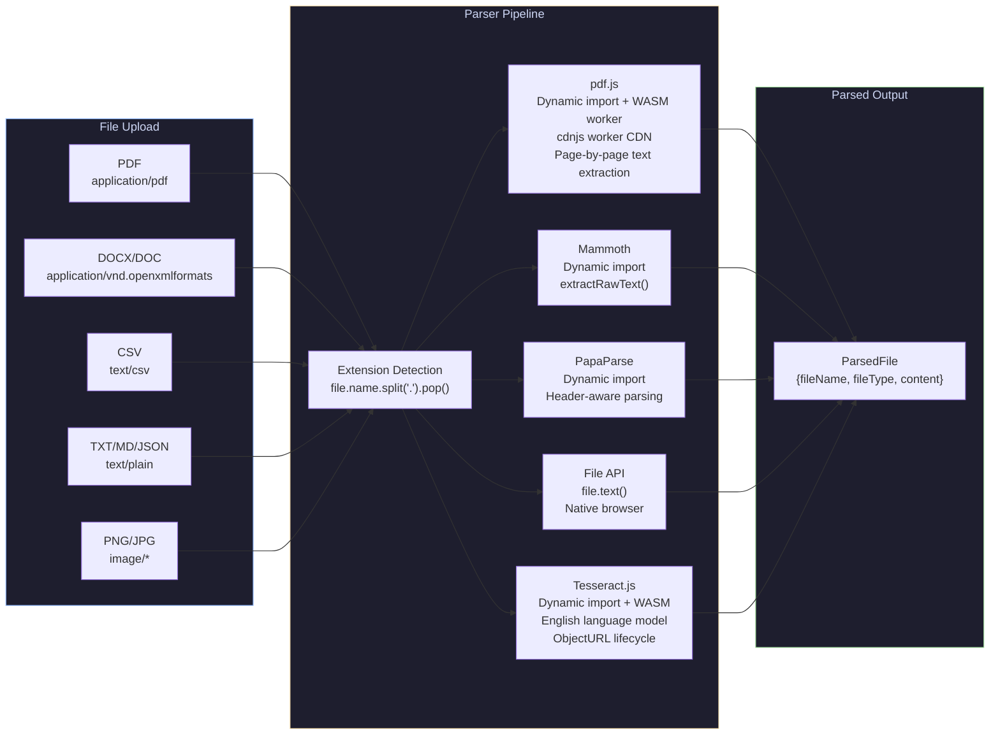
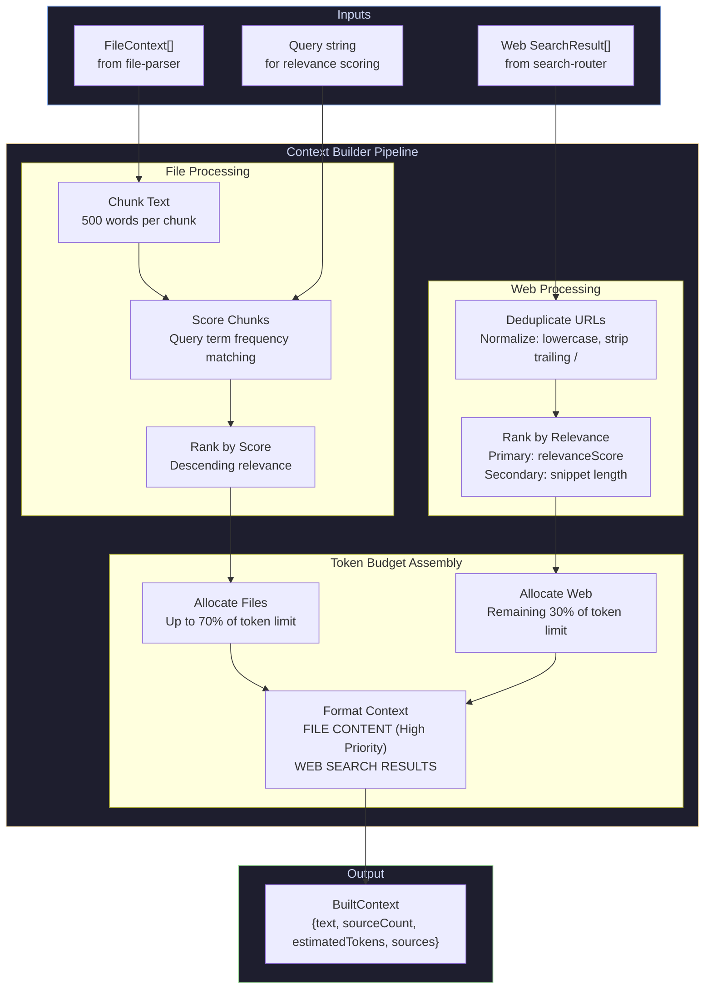
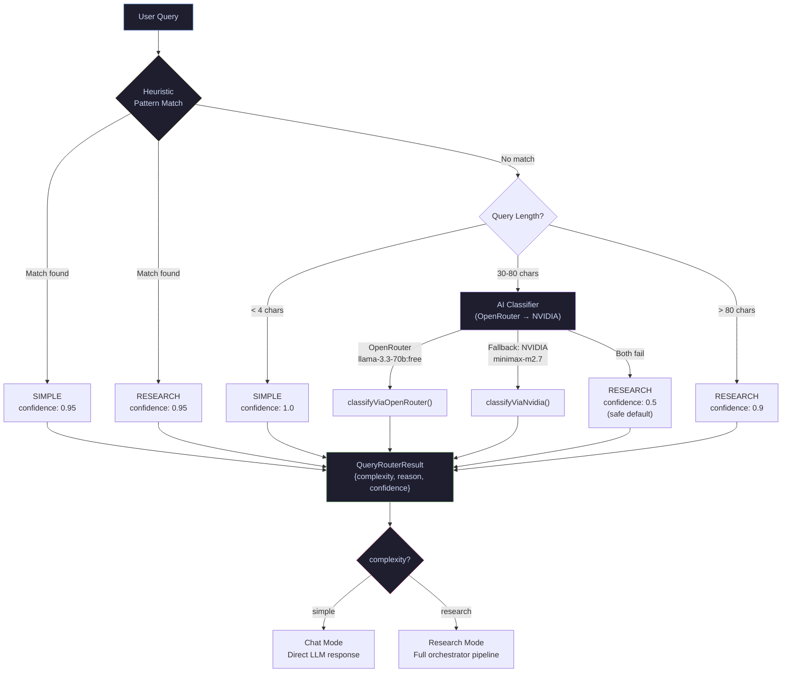
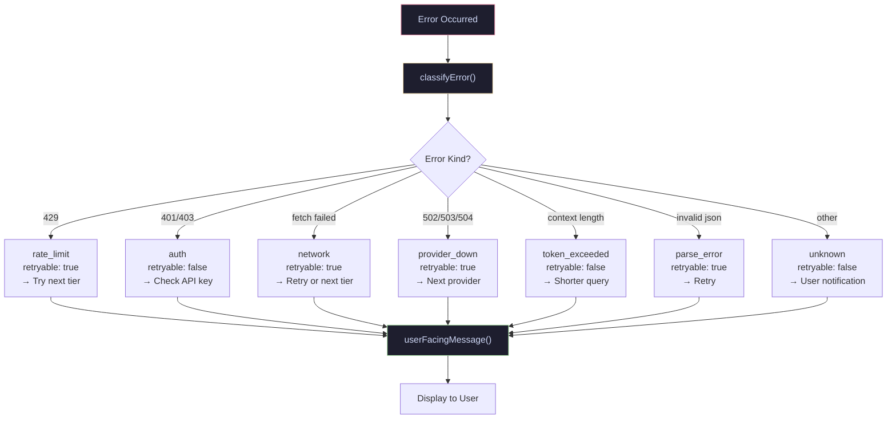

<div align="center">

# ResAgent

### Multi-Agent AI Research Assistant

An advanced, multi-agent orchestration engine that transforms raw queries into structured, citation-backed research reports — powered by NVIDIA NIM and OpenRouter LLMs with real-time SSE streaming.

[](https://nextjs.org/)
[](https://react.dev/)
[](https://www.typescriptlang.org/)
[](https://tailwindcss.com/)
[](#)

</div>

---

## Table of Contents

- [Features](#features)
- [System Architecture](#system-architecture)
- [Data Flow Diagram](#data-flow-diagram)
- [Orchestration Pipeline](#orchestration-pipeline)
- [Model Routing & Fallback System](#model-routing--fallback-system)
- [SSE Event Flow](#sse-event-flow)
- [File Parsing Pipeline](#file-parsing-pipeline)
- [Context Builder Pipeline](#context-builder-pipeline)
- [Query Classification Engine](#query-classification-engine)
- [Dev Stack](#dev-stack)
- [Agent Fleet](#agent-fleet)
- [Model Registry](#model-registry)
- [Fallback Chain Configuration](#fallback-chain-configuration)
- [Project Structure](#project-structure)
- [Getting Started](#getting-started)
- [Environment Variables](#environment-variables)
- [Configuration](#configuration)
- [Token Governance](#token-governance)
- [Error Handling & Classification](#error-handling--classification)
- [Design System](#design-system)
- [API Reference](#api-reference)
- [Scripts](#scripts)
- [Security](#security)
- [Performance Characteristics](#performance-characteristics)
- [Troubleshooting](#troubleshooting)
- [Contributing](#contributing)

---

## Features

### Core Research Engine

- **Multi-Agent Orchestration** — 7 specialized AI agents work in parallel across a 3-phase pipeline (Intelligence → Retrieval → Synthesis) to produce comprehensive research reports
- **3 Research Modes** — Choose between `corpus` (AI-knowledge only), `deep` (moderate web research), or `pro` (maximum agent capabilities with 8+ sources)
- **Real-Time SSE Streaming** — Live streaming of agent statuses, thinking steps, and report content directly to the UI with zero polling
- **Intelligent Query Expansion** — The Query Intelligence agent classifies intent (`coding`, `research`, `comparison`, `explanation`, `factual`, `general`) and generates subtopics and optimized search terms automatically
- **Dynamic Report Planning** — Generates structured research plans with fixed and dynamic sections, estimated page counts, and per-section agent assignments
- **Heuristic Query Routing** — Pattern-matching fast-path for simple queries (greetings, definitions) that bypasses the AI classifier entirely, saving API costs
- **Multi-Turn Conversation** — Supports `conversationHistory` context for follow-up queries and iterative research

### AI Provider Integration

- **Dual-Provider Architecture** — Primary execution on **NVIDIA NIM** (high-quality, billed per token) with automatic failover to **OpenRouter** (free-tier models for resiliency)
- **Smart Model Routing** — Task-aware model selection: reasoning models for analysis, coding models for snippets, fast models for summaries, balanced models for search
- **3-Tier Fallback Chain** — Each agent type has 3 tiers: NVIDIA Primary → NVIDIA Alternate → OpenRouter Free. If Tier 1 fails, Tier 2 fires automatically
- **Race-Based Fallback** — If the primary model is slow (>45s), the fallback model fires concurrently. First to succeed wins via `Promise.any()`
- **Free Model Rotation** — On OpenRouter 429 rate limits, the system rotates through 5 free models (`glm-4.5-air`, `gemma-4-31b`, `minimax-m2.5`, `nemotron-3-super`, `gpt-oss-120b`) automatically
- **15+ Model Registry** — Curated models including Kimi K2 Thinking, DeepSeek V3.2, Qwen 3 Coder 480B, Mistral Large 3, Nemotron 3 Super, Llama 3.3 70B, and more

### Document & File Processing

- **Multi-Format File Parsing** — Upload and parse **PDF** (via pdf.js), **DOCX** (via Mammoth), **CSV** (via PapaParse), **TXT/MD/JSON** (native), and **images** (via Tesseract.js OCR)
- **Local Processing** — Document parsing runs locally or via WebAssembly (WASM) to minimize data transit and protect privacy
- **Context Grounding** — Uploaded file content is chunked, scored by query relevance, and injected into the agent context pipeline with high priority (up to 70% of token budget)
- **Smart Chunking** — Files are split into 500-word chunks, scored against query terms, and ranked by relevance before inclusion

### UI & Export

- **Glassmorphism UI** — Modern, animated interface built with Tailwind CSS 4, Framer Motion, and shadcn/ui components with a matte black metallic theme
- **Agent Status Panel** — Real-time visibility into which agents are running, their assigned models, providers, durations, and fallback status
- **Thinking Panel** — Transparent view of the AI's reasoning process with timestamped thinking steps per phase
- **Citation Graph** — Interactive visualization of source relationships and relevance scores
- **PDF Export** — Generate downloadable A4 PDF reports with cover page, formatted tables, headers/footers, and page numbers via jsPDF + autoTable
- **Markdown Export** — Export reports as clean markdown with proper formatting
- **TXT Export** — Plain text export with markdown stripped
- **Source Cards** — Each source is displayed with title, snippet, domain, and relevance score for easy verification

### Reliability & Performance

- **Retry Logic** — 1 retry max with 500ms base delay and 2s cap (exponential backoff) before triggering fallback
- **Concurrency** — Phase 3 agents run in parallel via `Promise.all` with 200ms stagger to minimize TTFT and avoid rate limit bursts
- **Graceful Timeouts** — Section agents timeout after 150s with a graceful fallback response (no crash). Report agent gets 180s
- **Error Classification** — 7 error types (`rate_limit`, `auth`, `network`, `provider_down`, `token_exceeded`, `parse_error`, `unknown`) with retryability flags
- **Caching Hooks** — Built-in `use-cache` and `use-debounce` hooks for UI performance optimization
- **Context Builder** — Deduplicates URLs, ranks by relevance, and trims to token budget with 70/30 file/web allocation

---

## System Architecture

```mermaid
flowchart TB
    subgraph Client["Client Layer"]
        UI["Next.js 16 UI<br/>React 19 + Tailwind 4"]
        SSE["SSE Consumer<br/>EventSource API"]
        State["React State<br/>ChatMessage[]"]
    end

    subgraph API["API Layer"]
        Route["POST /api/research<br/>Next.js Route Handler"]
        Stream["TransformStream<br/>SSE Encoder"]
    end

    subgraph Orchestrator["Orchestrator Engine<br/>lib/engine/orchestrator.ts"]
        direction TB
        Cache["Cache Check<br/>SHA-256 Query Hash"]
        Memory["Memory Context<br/>User Preferences"]
        P1["Phase 1: Intelligence<br/>Query Intelligence Agent"]
        ModelSel["Model Selector Agent<br/>Per-Section Assignment"]
        P2["Phase 2: Parallel Research<br/>Section Research Agents"]
        P3["Phase 3: Report Synthesis<br/>Report Synthesis Agent"]
        Save["Save & Cache<br/>Supabase + Redis"]
    end

    subgraph Agents["Agent Fleet"]
        QI["Query Intelligence<br/>kimi-k2-thinking<br/>Intent + Plan"]
        WS["Web Search<br/>dracarys-70b<br/>Source Retrieval"]
        SA["Strategic Analysis<br/>nemotron-3-super<br/>Pattern Recognition"]
        FC["Fact-Check<br/>mistral-large-3<br/>Claim Verification"]
        CG["Coding<br/>qwen3-coder-480b<br/>Code Generation"]
        SM["Summary<br/>minimax-m2.7<br/>Key Insights"]
        RS["Report Synthesis<br/>kimi-k2-thinking<br/>Final Assembly"]
    end

    subgraph Providers["LLM Providers"]
        NVIDIA["NVIDIA NIM<br/>Primary Provider<br/>integrate.api.nvidia.com"]
        OPENR["OpenRouter<br/>Fallback Provider<br/>openrouter.ai/api"]
    end

    subgraph Parser["File Parser Pipeline"]
        PDF["PDF<br/>pdf.js + WASM Worker"]
        DOCX["DOCX<br/>Mammoth"]
        CSV["CSV<br/>PapaParse"]
        TXT["TXT/MD/JSON<br/>Native File API"]
        OCR["Image OCR<br/>Tesseract.js WASM"]
    end

    subgraph Context["Context Builder"]
        Chunk["Chunking<br/>500-word segments"]
        Score["Relevance Scoring<br/>Query term matching"]
        Dedup["URL Deduplication<br/>Normalized URLs"]
        Trim["Token Budget Trim<br/>70% files / 30% web"]
    end

    UI -->|"User Query + Files"| Route
    Route --> Stream
    Stream -->|"SSE Events"| SSE
    SSE --> State
    State --> UI

    Route --> Orchestrator

    Cache -->|"Hit"| Stream
    Cache -->|"Miss"| Memory
    Memory --> P1
    P1 --> ModelSel
    ModelSel --> P2
    P2 --> P3
    P3 --> Save
    Save --> Stream

    P1 --> QI
    P2 --> SA
    P2 --> FC
    P2 --> CG
    P2 --> SM
    P2 --> WS
    P3 --> RS

    Agents -->|"Tier 1"| NVIDIA
    NVIDIA -.|"On Failure<br/>(45s race timeout)"| OPENR

    Files["Uploaded Files"] --> Parser
    Parser --> Context
    WS --> Context
    Context -->|"BuiltContext"| P2

    style Client fill:#1e1e2e,stroke:#89b4fa,color:#cdd6f4
    style API fill:#1e1e2e,stroke:#a6e3a1,color:#cdd6f4
    style Orchestrator fill:#1e1e2e,stroke:#f9e2af,color:#cdd6f4
    style Agents fill:#1e1e2e,stroke:#cba6f7,color:#cdd6f4
    style Providers fill:#1e1e2e,stroke:#f38ba8,color:#cdd6f4
    style Parser fill:#1e1e2e,stroke:#94e2d5,color:#cdd6f4
    style Context fill:#1e1e2e,stroke:#fab387,color:#cdd6f4
```

---

## Data Flow Diagram



---

## Orchestration Pipeline



### Phase Details

| Phase | Name | Execution | Agents | Timeout | Progress |
|:------|:-----|:----------|:-------|:--------|:---------|
| **1** | Intelligence | Sequential | Query Intelligence, Model Selector | 90s | 5% → 15% |
| **2** | Parallel Research | Parallel (`Promise.allSettled`) | Section Research Agents (N dynamic) | 150s per agent | 18% → 70% |
| **3** | Synthesis | Sequential | Report Synthesis | 180s | 80% → 100% |

---

## Model Routing & Fallback System



---

## SSE Event Flow



### SSE Event Types

| Event Name | Backend `type` | Description | Payload Fields |
|:-----------|:---------------|:------------|:---------------|
| `status` | `status` | General status update | `phase`, `percent`, `status` |
| `status` | `plan_ready` | Research plan generated | `phase`, `percent`, `status` |
| `status` | `models_assigned` | Models assigned to sections | `phase`, `percent`, `status` |
| `agent_status` | `agent_update` | Individual agent progress | `sectionId`, `agentRole`, `status`, `wordCount`, `sourcesFound`, `confidence` |
| `status` | `phase_complete` | Phase transition complete | `phase`, `percent`, `completedSections`, `failedSections` |
| `result` | `result` | Final report data | Full `ResearchResult` object |
| `done` | `complete` | Stream finished | `{type:"complete"}` |
| `error` | `error` | Error occurred | `message` |
| `status` | `warning` | Recoverable warning | `message` |
| `status` | `debug` | API connectivity tests (dev only) | `apiTests` |

---

## File Parsing Pipeline



### Supported File Formats

| Format | Extension | Parser | Notes |
|:-------|:----------|:-------|:------|
| PDF | `.pdf` | pdf.js | Dynamic import, WASM worker from CDN, page-by-page extraction |
| Word | `.doc`, `.docx` | Mammoth | Dynamic import, `extractRawText()` |
| CSV | `.csv` | PapaParse | Dynamic import, header-aware, row-by-row join |
| Text | `.txt`, `.md`, `.json` | Native `File.text()` | Direct browser API |
| Image | `.png`, `.jpg`, `.jpeg` | Tesseract.js | WASM OCR, English model, ObjectURL cleanup |

---

## Context Builder Pipeline



---

## Query Classification Engine



### Heuristic Patterns

| Pattern Type | Examples | Classification |
|:-------------|:---------|:---------------|
| Greetings | `hi`, `hello`, `hey`, `how are you` | `simple` |
| Thanks | `thanks`, `thank you`, `cheers` | `simple` |
| Acknowledgments | `ok`, `got it`, `sure`, `yes`, `no` | `simple` |
| Simple definitions | `what is a variable?` | `simple` |
| Short factual | `who created Python?` | `simple` |
| Research keywords | `report`, `analysis`, `compare`, `research`, `trend` | `research` |
| Code requests | `code`, `debug`, `implement`, `build` | `research` |
| Long queries | > 80 characters | `research` |

---

## Dev Stack

| Layer | Technology | Version | Purpose |
|:------|:-----------|:--------|:--------|
| **Framework** | Next.js (App Router) | `16.2.4` | Full-stack React framework with server components, API routes, and SSE streaming |
| **UI Library** | React | `19.2.4` | Component-based UI with concurrent features and Suspense |
| **Language** | TypeScript | `5.x` | Type-safe development with strict mode, path aliases (`@/*`) |
| **Styling** | Tailwind CSS | `4.0` | Utility-first CSS with custom theme, `tw-animate-css` animations |
| **Components** | shadcn/ui + Radix | `4.2.0` | Accessible, composable UI primitives (Button, Dialog, DropdownMenu, Collapsible) |
| **Animations** | Framer Motion | `12.38` | Physics-based animations and transitions |
| **PDF Parsing** | pdf.js | `5.6.205` | Client-side PDF text extraction with WASM worker |
| **DOCX Parsing** | Mammoth | `1.12.0` | Convert DOCX to raw text |
| **CSV Parsing** | PapaParse | `5.5.3` | Fast CSV parsing with header detection |
| **OCR** | Tesseract.js | `7.0.0` | WebAssembly-based optical character recognition (English) |
| **Markdown** | react-markdown + remark-gfm | `10.1.0` | Render markdown with GitHub-flavored extensions (tables, strikethrough) |
| **PDF Export** | jsPDF + autoTable | `4.2.1` | Generate downloadable A4 PDF reports with cover page and tables |
| **Icons** | Lucide React | `1.8.0` | Consistent icon system |
| **CSS Utils** | clsx + tailwind-merge + CVA | — | Conditional class composition and variant management |
| **Primary LLM** | NVIDIA NIM | — | High-quality inference (Kimi K2, DeepSeek, Qwen, Mistral, Nemotron, MiniMax) |
| **Fallback LLM** | OpenRouter | — | Free-tier model fallback (Llama 3.3, Gemma 4, GPT-OSS, GLM 4.5) |
| **Linting** | ESLint | `9.x` | Flat config with `eslint-config-next` |

---

## Agent Fleet

| Agent | Role | Primary Model | Fallback Model | Phase | Timeout | Max Tokens |
|:------|:-----|:-------------|:---------------|:------|:--------|:-----------|
| **Query Intelligence** | Intent classification, query expansion, research plan generation with sections | `kimi-k2-thinking` | `gpt-oss-120b:free` | 1 | 90s | 8,192 |
| **Model Selector** | Per-section model assignment based on task type | `mistral-large-3` | — | 1 | 90s | 8,192 |
| **Web Search** | Concurrent real-time web data retrieval with source generation | `dracarys-70b` | `llama-3.3-70b:free` | 2 | 90s | 16,384 |
| **Section Research** | Per-section deep research with web search + file context | Assigned per section | 3-tier fallback | 2 | 150s | 8,000–16,384 |
| **Strategic Analysis** | Pattern recognition, correlation analysis, deep reasoning | `nemotron-3-super` | `nemotron-3-super:free` | 3 | 90s | 16,384 |
| **Fact-Check** | Automated verification of claims against sources | `mistral-large-3` | `llama-3.3-70b:free` | 3 | 90s | 8,192 |
| **Coding** | Technical snippet generation and code analysis | `qwen3-coder-480b` | `qwen3-coder:free` | 3 | 90s | 16,384 |
| **Summary** | High-speed overview and key insight extraction | `minimax-m2.7` | `gemma-4-31b:free` | 3 | 90s | 8,192 |
| **Report Synthesis** | Final markdown assembly, quality control, and formatting | `kimi-k2-thinking` | `gpt-oss-120b:free` | 3 | 180s | 32,768 |

---

## Model Registry

### NVIDIA NIM Models (Primary)

| Model ID | Display Name | Type | Context Length | Cost Priority | Used By |
|:---------|:-------------|:-----|:---------------|:-------------|:--------|
| `minimaxai/minimax-m2.7` | MiniMax M2.7 | fast | 32,768 | 1 | Summary Agent |
| `moonshotai/kimi-k2-thinking` | Kimi K2 Thinking | reasoning | 32,768 | 2 | Query Intelligence, Report Synthesis |
| `abacusai/dracarys-llama-3.1-70b-instruct` | Dracarys Llama 3.1 70B | balanced | 32,768 | 2 | Web Search, Default |
| `mistralai/mistral-large-3-675b-instruct-2512` | Mistral Large 3 | balanced | 32,768 | 3 | Fact-Check, Query Intelligence |
| `deepseek-ai/deepseek-v3.2` | DeepSeek V3.2 | reasoning | 32,768 | 3 | Analysis, Technical, Financial |
| `z-ai/glm4.7` | GLM 4.7 | balanced | 32,768 | 2 | Market Research, Fallback |
| `qwen/qwen3-coder-480b-a35b-instruct` | Qwen 3 Coder 480B | coding | 32,768 | 3 | Code Generation |
| `nvidia/nemotron-3-super-120b-a12b` | Nemotron 3 Super 120B | balanced | 32,768 | 2 | Analysis, Report Synthesis |

### OpenRouter Models (Fallback)

| Model ID | Display Name | Type | Context Length | Cost Priority | Used By |
|:---------|:-------------|:-----|:---------------|:-------------|:--------|
| `nvidia/nemotron-3-super-120b-a12b:free` | Nemotron 3 Super (Free) | balanced | 32,768 | 1 | Analysis fallback |
| `qwen/qwen3-coder:free` | Qwen 3 Coder (Free) | coding | 32,768 | 1 | Coding fallback |
| `meta-llama/llama-3.3-70b-instruct:free` | Llama 3.3 70B (Free) | balanced | 131,072 | 1 | Search, Fact-Check fallback |
| `openai/gpt-oss-120b:free` | GPT-OSS 120B (Free) | reasoning | 32,768 | 1 | Query, Report fallback |
| `z-ai/glm-4.5-air:free` | GLM 4.5 Air (Free) | fast | 32,768 | 1 | Summary fallback, 429 rotation |
| `google/gemma-4-31b-it:free` | Gemma 4 31B (Free) | fast | 32,768 | 1 | Summary fallback, 429 rotation |
| `minimax/minimax-m2.5:free` | MiniMax M2.5 (Free) | fast | 32,768 | 1 | 429 rotation |

---

## Fallback Chain Configuration

Each agent type has a dedicated 3-tier fallback chain defined in `lib/engine/config/fallback-config.ts`:

| Agent Type | Tier 1 (NVIDIA) | Tier 2 (NVIDIA Alt) | Tier 3 (OpenRouter Free) |
|:-----------|:----------------|:--------------------|:------------------------|
| `queryIntelligence` | `mistral-large-3` | `nemotron-3-super` | `gpt-oss-120b:free` |
| `webSearch` | `dracarys-70b` | `glm4.7` | `glm-4.5-air:free` |
| `financialAnalysis` | `deepseek-v3.2` | `kimi-k2-thinking` | `gpt-oss-120b:free` |
| `riskAnalysis` | `kimi-k2-thinking` | `deepseek-v3.2` | `gpt-oss-120b:free` |
| `marketResearch` | `glm4.7` | `mistral-large-3` | `nemotron-3-super:free` |
| `technicalAnalysis` | `deepseek-v3.2` | `nemotron-3-super` | `gpt-oss-120b:free` |
| `codeGeneration` | `qwen3-coder-480b` | `deepseek-v3.2` | `qwen3-coder:free` |
| `factChecking` | `kimi-k2-thinking` | `mistral-large-3` | `gpt-oss-120b:free` |
| `summarization` | `minimax-m2.7` | `glm4.7` | `glm-4.5-air:free` |
| `reportSynthesis` | `nemotron-3-super` | `mistral-large-3` | `nemotron-3-super:free` |
| `balancedResearch` | `dracarys-70b` | `nemotron-3-super` | `llama-3.3-70b:free` |

### Retryable Error Codes

| Code | Meaning | Retryable? | Action |
|:-----|:--------|:-----------|:-------|
| `429` | Rate limit exceeded | Yes | Move to next tier |
| `500` | Internal server error | Yes | Move to next tier |
| `502` | Bad gateway | Yes | Move to next tier |
| `503` | Service unavailable | Yes | Move to next tier |
| `504` | Gateway timeout | Yes | Move to next tier |
| `400` | Bad request | No | Fatal — do not retry |
| `401` | Unauthorized | Yes* | Try next tier (key issue) |
| `402` | Credits exhausted | Yes | Move to next tier |

---

## Project Structure

```
research-assistant/
├── app/
│   ├── api/
│   │   └── research/
│   │       └── route.ts              # Research API endpoint (SSE + JSON)
│   ├── about-us/
│   │   └── page.tsx                  # About page
│   ├── privacy-policy/
│   │   └── page.tsx                  # Privacy policy page
│   ├── terms-and-conditions/
│   │   └── page.tsx                  # Terms page
│   ├── globals.css                   # Design tokens + glassmorphism + metallic theme
│   ├── layout.tsx                    # Root layout with metadata
│   ├── page.tsx                      # Main research interface
│   └── icon.tsx                      # Dynamic favicon
├── components/
│   ├── agents/
│   │   ├── agent-settings-modal.tsx  # Agent configuration UI
│   │   ├── agent-status-panel.tsx    # Real-time agent status display
│   │   └── thinking-panel.tsx        # AI reasoning transparency
│   ├── export/
│   │   └── export-buttons.tsx        # PDF/MD/TXT export controls
│   ├── layout/
│   │   └── sidebar.tsx               # Navigation sidebar
│   ├── profile/
│   │   └── profile-modal.tsx         # User profile & API key management
│   ├── response/
│   │   ├── response-area.tsx         # Main response renderer
│   │   ├── source-card.tsx           # Individual source display
│   │   ├── source-modal.tsx          # Source detail modal
│   │   └── sources-section.tsx       # Sources collection
│   ├── search/
│   │   ├── citation-graph-modal.tsx  # Citation relationship graph
│   │   ├── model-selector.tsx        # LLM model picker
│   │   ├── quick-search-modal.tsx    # Quick search overlay
│   │   ├── search-controls.tsx       # Mode & settings controls
│   │   └── search-input.tsx          # Main query input
│   └── ui/
│       ├── button.tsx                # shadcn Button (CVA variants)
│       ├── collapsible.tsx           # shadcn Collapsible (Radix)
│       ├── dialog.tsx                # shadcn Dialog (Radix)
│       └── dropdown-menu.tsx         # shadcn DropdownMenu (Radix)
├── hooks/
│   ├── use-cache.ts                  # Response caching hook
│   ├── use-debounce.ts               # Input debouncing hook
│   └── use-mobile.ts                 # Mobile detection hook
├── lib/
│   ├── engine/
│   │   ├── agents/
│   │   │   ├── base-agent.ts         # Base agent with callWithFallback(), race strategy
│   │   │   ├── analysis-agent.ts     # Strategic analysis
│   │   │   ├── coding-agent.ts       # Code generation
│   │   │   ├── fact-check-agent.ts   # Claim verification
│   │   │   ├── model-selector-agent.ts # Per-section model assignment
│   │   │   ├── query-intelligence-agent.ts # Intent & planning
│   │   │   ├── report-agent.ts       # Report generation (legacy)
│   │   │   ├── report-synthesis-agent.ts # Final synthesis
│   │   │   ├── section-research-agent.ts # Per-section research
│   │   │   ├── summary-agent.ts      # Overview generation
│   │   │   └── web-search-agent.ts   # Web retrieval
│   │   ├── config/
│   │   │   ├── fallback-config.ts    # 3-tier fallback chains per agent type
│   │   │   └── model-config.ts       # Model registry & routing
│   │   ├── providers/
│   │   │   ├── nvidia.ts             # NVIDIA NIM provider (complete + stream + retry)
│   │   │   ├── openrouter.ts         # OpenRouter provider (complete + stream + retry + 429 rotation)
│   │   │   ├── sonar.ts              # Perplexity Sonar (deprecated stub)
│   │   │   ├── fallback-executor.ts  # 3-tier sequential fallback executor
│   │   │   └── index.ts              # Provider exports + generateAIResponse()
│   │   ├── debug/
│   │   │   └── api-test.ts           # API connectivity tests (dev only)
│   │   ├── config.ts                 # Global config (TOKEN_LIMITS, MODE_CONFIG, MODEL_REGISTRY, AGENT_MODEL_MAP)
│   │   ├── context-builder.ts        # Context assembly (chunking, scoring, dedup, trim)
│   │   ├── errors.ts                 # ResearchError class + 7 error kinds + user-facing messages
│   │   ├── file-parser.ts            # Multi-format file parsing (PDF, DOCX, CSV, TXT, OCR)
│   │   ├── model-router.ts           # Task-to-model routing + fallback chain builder
│   │   ├── orchestrator.ts           # Main 3-phase orchestrator
│   │   ├── planning-workflow.ts      # Research plan execution
│   │   ├── query-enhancer.ts         # Query enhancement logic
│   │   ├── query-router.ts           # Heuristic + AI query classification
│   │   ├── report-assembler.ts       # Report section assembly
│   │   ├── response-normalizer.ts    # Response normalization
│   │   ├── search-router.ts          # Search with NVIDIA → OpenRouter fallback
│   │   └── types.ts                  # 50+ TypeScript interfaces and types
│   ├── export/
│   │   └── pdf-exporter.ts           # PDF generation (cover page, sections, tables, footers)
│   ├── export-pdf.ts                 # PDF export utilities
│   └── utils.ts                      # General utilities (cn, clsx, tailwind-merge)
├── .env.example                      # Environment template
├── .env.mcp.example                  # MCP server configuration template
├── AGENTS.md                         # Agent fleet operations manifest
├── CLAUDE.md                         # Development guide for AI assistants
├── SECURITY.md                       # Security policy & vulnerability reporting
├── SKILLS.md                         # Skills documentation
├── components.json                   # shadcn/ui configuration (base-nova style)
├── eslint.config.mjs                 # ESLint flat config
├── next.config.ts                    # Next.js configuration
├── package.json                      # Dependencies & scripts
├── postcss.config.mjs                # PostCSS configuration
└── tsconfig.json                     # TypeScript configuration (strict, bundler resolution)
```

---

## Getting Started

### Prerequisites

- **Node.js** `18.17` or later
- **npm** `9.x` or later
- API keys from [NVIDIA NIM](https://build.nvidia.com) and [OpenRouter](https://openrouter.ai)

### Installation

```bash
# 1. Clone the repository
git clone https://github.com/your-username/research-assistant.git
cd research-assistant

# 2. Install dependencies
npm install

# 3. Configure environment variables
cp .env.example .env.local
# Edit .env.local with your API keys (see Environment Variables section)

# 4. Start the development server
npm run dev
```

The application will be available at [http://localhost:3000](http://localhost:3000).

### Quick Usage

1. **Type your research query** in the search input (e.g., "Compare quantum computing approaches in 2026")
2. **Select a research mode**: `corpus` (fast, no web), `deep` (moderate), or `pro` (comprehensive)
3. **Optionally upload files** (PDF, DOCX, CSV, or images) for context-grounded research
4. **Watch the agents work** in real-time via the Agent Status Panel and Thinking Panel
5. **Export your report** as PDF, Markdown, or plain text

### Production Build

```bash
npm run build
npm start
```

---

## Environment Variables

Create a `.env.local` file in the project root:

```bash
# ── Required ──────────────────────────────────────────────────────

# NVIDIA NIM API Key — Primary LLM provider
# Get yours at: https://build.nvidia.com
NVIDIA_API_KEY=nvapi-xxxxxxxxxxxx

# OpenRouter API Key — Fallback LLM provider
# Get yours at: https://openrouter.ai
OPENROUTER_API_KEY=sk-or-v1-xxxxxxxxxxxx

# ── Optional ──────────────────────────────────────────────────────

# Application base URL (default: http://localhost:3000)
NEXT_PUBLIC_APP_URL=http://localhost:3000
```

> **Security Note:** Never commit `.env.local` to version control. The `.gitignore` is pre-configured to exclude all `.env*` files. If you accidentally expose a key, revoke it immediately.

---

## Configuration

### Research Modes

| Mode | Max Sources | Search Provider | Description | Best For |
|:-----|:-----------|:----------------|:------------|:---------|
| `corpus` | 0 | None | Fast report using pure AI knowledge. No web search. | Quick overviews, offline research |
| `deep` | 4 | NVIDIA + OpenRouter fallback | Moderate web research combined with AI analysis. | Balanced speed and depth |
| `pro` | 8 | NVIDIA + OpenRouter fallback | Comprehensive deep research using maximum agent capabilities. | Thorough reports, academic research |

### Token Limits

| Parameter | Limit | Description |
|:----------|:------|:------------|
| Context Window | `131,072` | Maximum input context across all agents |
| Max Response | `32,768` | Maximum output tokens per response |
| Per-Agent Cap | `16,384` | Token budget per individual agent |
| Report Agent | `32,768` | Dedicated budget for final report synthesis |
| Words-to-Token Ratio | `1.3` | Conversion factor for token estimation |

### Retry Configuration

| Parameter | Value | Description |
|:----------|:------|:------------|
| Max Retries | `1` | Single retry before fallback trigger |
| Base Delay | `500ms` | Initial retry delay (exponential backoff) |
| Max Delay | `2,000ms` | Maximum retry backoff cap |

### Timeout Configuration

| Component | Timeout | Description |
|:----------|:--------|:------------|
| Primary Model | `90,000ms` (90s) | Per-model timeout for standard agents |
| Fallback Race | `45,000ms` (45s) | Time before fallback fires concurrently |
| Report Agent | `180,000ms` (180s) | Extended timeout for 5-6 page synthesis |
| Section Agent | `150,000ms` (150s) | Graceful timeout with fallback content |
| NVIDIA Provider | `90,000ms` (90s) | HTTP request timeout |
| OpenRouter Provider | `90,000ms` (90s) | HTTP request timeout |

---

## Token Governance

ResAgent enforces strict token budgets to ensure report density without sacrificing analytical depth:

| Rule | Limit | Purpose |
|:-----|:------|:--------|
| **System Context** | 32,768 Tokens | Maximum context passed to any agent |
| **Max Report** | 16,384 Tokens | Report synthesis output budget |
| **Per-Agent Cap** | 8,192 Tokens | Individual agent output budget |
| **File Context** | 70% of token limit | Maximum allocation for uploaded file content |
| **Web Context** | 30% of token limit | Maximum allocation for web search results |

Tokens are managed at the orchestrator level. Each agent receives its budget in the `AgentContext` and must stay within limits. The report agent gets the largest allocation for final synthesis.

---

## Error Handling & Classification



### Error Types

| Kind | Retryable | User Message |
|:-----|:----------|:-------------|
| `rate_limit` | Yes | "Too many requests — retrying with a different provider..." |
| `auth` | No | "API key is missing or invalid. Please check your configuration." |
| `network` | Yes | "Could not connect to the service. Check your internet connection." |
| `provider_down` | Yes | "The AI provider is temporarily down. Trying an alternative..." |
| `token_exceeded` | No | "The query is too complex. Try a shorter or simpler question." |
| `parse_error` | Yes | "Failed to process the response. Trying again..." |
| `unknown` | No | "Something went wrong. Please try again." |

---

## Design System

### Theme: Matte Black & White (Metallic Finish)

| Token | Value | Usage |
|:------|:------|:------|
| `--background` | `#0C0C0C` | Page background |
| `--foreground` | `#F5F5F5` | Primary text |
| `--card` | `rgba(255, 255, 255, 0.04)` | Card surfaces |
| `--primary` | `#FFFFFF` | Primary actions, headings |
| `--secondary` | `#A0A0A0` | Secondary text, muted elements |
| `--muted` | `rgba(255, 255, 255, 0.06)` | Muted surfaces |
| `--border` | `rgba(255, 255, 255, 0.12)` | Borders (brushed steel) |
| `--destructive` | `#EF4444` | Error states |
| `--glow` | `rgba(255, 255, 255, 0.6)` | Glow effects |
| `--glass` | `rgba(12, 12, 12, 0.9)` | Glassmorphism background |
| `--glass-border` | `rgba(255, 255, 255, 0.1)` | Glass border |

### CSS Utilities

| Class | Description |
|:------|:------------|
| `.glass` | Glassmorphism effect with backdrop blur |
| `.glass-card` | Gradient glass card with subtle border |
| `.glass-strong` | Stronger glass effect for overlays |
| `.metallic` | Metallic surface gradient |
| `.text-gradient` | White-to-silver metallic text gradient |
| `.border-shine` | Animated border shine effect |
| `.primary-glow` | White glow shadow |
| `.streak-1/2/3` | Decorative light streaks |

### Typography

| Element | Responsive Sizes |
|:--------|:-----------------|
| `h1` | `text-3xl` → `md:text-5xl` → `lg:text-6xl` |
| `h2` | `text-2xl` → `md:text-3xl` → `lg:text-4xl` |
| `h3` | `text-xl` → `md:text-2xl` |

### Fonts

| Variable | Usage |
|:---------|:------|
| `--font-sans` (Inter) | Body text |
| `--font-mono` (Geist Mono) | Code blocks |
| `--font-heading` (Playfair) | Headings |

---

## API Reference

### `POST /api/research`

Initiates a research session. Supports both SSE streaming and JSON response modes.

**Request Body:**

```typescript
{
  query: string;                          // Research query (required)
  mode: "corpus" | "deep" | "pro";       // Research mode (default: "deep")
  workflowMode?: "chat" | "planning" | "research";
  model?: string;                         // Override model selection
  stream?: boolean;                       // Enable SSE streaming (default: true)
  files?: FileContext[];                  // Uploaded files for context
  conversationHistory?: LLMMessage[];     // Multi-turn conversation context
  disabledAgents?: AgentName[];           // Agents to skip
  userId?: string;                        // User ID for memory/caching
  conversationId?: string;                // Conversation ID for persistence
}
```

**FileContext Type:**

```typescript
interface FileContext {
  fileName: string;   // Original filename
  fileType: string;   // MIME type
  content: string;    // Extracted text content
}
```

**LLMMessage Type:**

```typescript
interface LLMMessage {
  role: "system" | "user" | "assistant";
  content: string;
}
```

**Response Headers (SSE):**

```
Content-Type: text/event-stream
Cache-Control: no-cache
Connection: keep-alive
X-Accel-Buffering: no
```

**Response (JSON mode, `stream: false`):**

```typescript
{
  success: boolean;
  data?: ResearchResult;
  error?: string;
}
```

**ResearchResult Type:**

```typescript
interface ResearchResult {
  overview: string;           // Executive summary
  keyInsights: string[];      // Key findings list
  details: string;            // Full report content (markdown)
  comparison: string;         // Comparison section
  expertInsights: string[];   // Expert quotes
  conclusion: string;         // Conclusions section
  code?: string;              // Generated code (if applicable)
  factCheck?: string;         // Fact-check results
  sources: ResearchSource[];  // All sources used
  references: ResearchSource[]; // Reference list
  agentResults?: AgentResult[]; // Per-agent results
  metadata: {
    model: string;            // Primary model used
    provider: string;         // Primary provider
    searchProvider: string;   // Search provider used
    intent: IntentType;       // Classified intent
    tokensUsed: number;       // Total tokens consumed
    durationMs: number;       // Total duration in ms
    isFallback?: boolean;     // Whether fallback was used
    agentTrace?: AgentStatusEvent[]; // Full agent trace
  };
}
```

**ResearchSource Type:**

```typescript
interface ResearchSource {
  id: string;
  title: string;
  snippet: string;
  url: string;
  domain: string;
}
```

---

## Scripts

| Command | Description | Port |
|:--------|:------------|:-----|
| `npm run dev` | Start development server with hot reload | `localhost:3000` |
| `npm run build` | Create optimized production build | — |
| `npm start` | Start production server | `localhost:3000` |
| `npm run lint` | Run ESLint with flat config | — |

---

## Security

- **API Keys** — Stored in environment variables, never hardcoded. `.gitignore` excludes all `.env*` files
- **Local Processing** — Document parsing (PDF, DOCX, OCR) runs via WebAssembly to minimize data transit
- **No Persistence** — ResAgent does not store uploaded documents or search history by default
- **Secret Masking** — Logs and SSE streams never leak raw API keys or sensitive credentials
- **Input Sanitization** — All user input is sanitized before being passed to LLM prompts
- **SHA-256 Caching** — Query hashes for cache keys, not raw queries

For vulnerability reports, see [SECURITY.md](./SECURITY.md).

---

## Performance Characteristics

| Metric | Value | Notes |
|:-------|:------|:------|
| **Time to First Event** | ~200ms | SSE stream opens immediately |
| **Phase 1 (Intelligence)** | 5–15s | Query classification + plan generation |
| **Phase 2 (Research)** | 15–60s | Parallel agents, depends on mode and section count |
| **Phase 3 (Synthesis)** | 10–45s | Report compilation |
| **Total (corpus mode)** | 20–40s | No web search, fastest |
| **Total (deep mode)** | 30–90s | 4 sources, moderate depth |
| **Total (pro mode)** | 45–180s | 8+ sources, maximum depth |
| **Agent Stagger** | 200ms | Prevents rate limit bursts |
| **Fallback Race Window** | 45s | Primary gets 45s before fallback fires concurrently |
| **Free Model Rotation** | 5 models | Automatic rotation on OpenRouter 429s |

---

## Troubleshooting

### Common Issues

| Issue | Cause | Solution |
|:------|:------|:---------|
| "No API keys configured" | Missing `.env.local` | Copy `.env.example` to `.env.local` and add keys |
| "API key is missing or invalid" | Wrong key or expired | Check key at NVIDIA/OpenRouter dashboard |
| "Rate limit exceeded" | Too many requests | Wait or add credits. System auto-retries with fallback |
| "The query is too complex" | Token limit exceeded | Shorten query or use `corpus` mode |
| "Could not connect to service" | Network issue | Check internet connection |
| Report times out | Agent timeout | Use `deep` mode instead of `pro`, or simplify query |
| Empty report sections | All agents failed | Check API keys and network. System falls back to raw sections |
| PDF export fails | Browser popup blocked | Allow popups for the application domain |

### Debug Mode

In development (`NODE_ENV=development`), the API route runs connection tests before research:
- Tests NVIDIA NIM connectivity
- Tests OpenRouter connectivity
- Sends results as `debug` SSE event

---

## Contributing

1. Fork the repository
2. Create a feature branch (`git checkout -b feature/amazing-feature`)
3. Commit your changes (`git commit -m 'Add amazing feature'`)
4. Push to the branch (`git push origin feature/amazing-feature`)
5. Open a Pull Request

### Code Style

- **TypeScript** — Strict mode, all types defined in `lib/engine/types.ts` (50+ interfaces)
- **Components** — Feature-based structure under `components/`, using shadcn/ui + Radix
- **Agents** — Extend `BaseAgent` or follow the functional runner pattern in `lib/engine/agents/`
- **Styling** — Tailwind 4 utilities with glassmorphism (`.glass`, `.glass-card`) and metallic theme
- **Streaming** — All research logic must support SSE via `StreamCallback`
- **Error Handling** — Use `ResearchError` class from `lib/engine/errors.ts` with proper `ErrorKind`
- **Providers** — Always implement retry + fallback. Use `callWithFallback()` from `base-agent.ts`
- **File Parsing** — Dynamic imports only (avoid SSR issues). Clean up ObjectURLs after OCR

### Architecture Decisions

- **Why NVIDIA NIM + OpenRouter?** — NVIDIA provides high-quality models at reasonable cost. OpenRouter's free tier provides resilience without additional cost
- **Why SSE over WebSockets?** — SSE is simpler, works over HTTP/2, auto-reconnects, and is sufficient for unidirectional server-to-client streaming
- **Why `Promise.allSettled` over `Promise.all`?** — Individual agent failures should not crash the entire pipeline. Settled promises allow partial results
- **Why 200ms stagger?** — Prevents thundering herd on rate limits when launching multiple agents simultaneously
- **Why 70/30 file/web allocation?** — User-uploaded files are higher priority context. The 70% cap ensures web results still contribute

---

<div align="center">

**Built by [Girish Lade](https://ladestack.in)** · [LinkedIn](https://www.linkedin.com/in/girish-lade-075bba201/)

</div>
