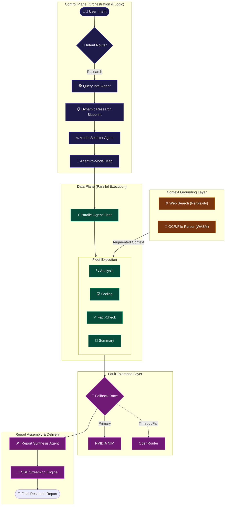

<div align="center">

# 🔬 ResAgent — Advanced Multi-Agent Research Orchestrator

[](https://nextjs.org/)
[](https://react.dev/)
[](https://www.typescriptlang.org/)
[](https://tailwindcss.com/)
[](https://www.nvidia.com/en-us/ai/)

**Next-Generation Multi-Agent Research Engine**  
*Transform raw queries into exhaustive, structured, and fact-checked intelligence reports.*

[Project Overview](#-project-overview) • [Key Features](#-key-features) • [System Architecture](#-system-architecture) • [Dev Stack](#-development-stack) • [Installation](#-installation--setup) • [Configuration](#-configuration) • [Project Stats](#-project-stats--metrics) • [Usage Guide](#-usage-guide)

</div>

---

## 📋 Project Overview

**ResAgent** is a production-grade, multi-agent AI research system engineered for **depth**, **accuracy**, and **scale**. It orchestrates a **fleet of specialized AI agents** across a multi-phase pipeline to deliver exhaustive, citation-rich research reports in real-time.

> [!IMPORTANT]
> **ResAgent** features **Dynamic Model Routing** with automatic fallback to high-capacity context models (up to **131,072 tokens**). A unique race-condition fallback mechanism ensures zero downtime by firing concurrent requests to OpenRouter if primary endpoints stall.

---

## ✨ Key Features

### 🌐 Intelligent Data Retrieval
*   **Targeted Augmentation:** Concurrent web searches triggered by refined research blueprints.
*   **Multi-Modal Intake:** Seamlessly ingest and parse complex local files:
    *   **PDF Parsing:** High-fidelity text extraction via `pdfjs-dist`.
    *   **Word Documents:** Comprehensive DOCX processing via `mammoth`.
    *   **Structured Data:** CSV and datasheet handling with `PapaParse`.
    *   **Image OCR:** WebAssembly-powered text extraction from images via `Tesseract.js`.

### 🤖 Specialized Agent Fleet
| Agent | Primary Role | Primary Model (NVIDIA NIM) | Fallback (OpenRouter) |
| :--- | :--- | :--- | :--- |
| **Query Intelligence** | Refines and enhances raw user prompts | `mistral-large-3` | `gpt-oss-120b:free` |
| **Web Search** | Concurrent real-time data retrieval | `dracarys-70b` | `llama-3.3-70b:free` |
| **Analysis** | Pattern recognition & correlation analysis | `nemotron-3-super` | `nemotron-3:free` |
| **Fact-Check** | Automated verification of claims vs sources | `mistral-large-3` | `llama-3.3-70b:free` |
| **Coding** | Specialized technical snippet generation | `qwen3-coder-480b` | `qwen3-coder:free` |
| **Summary** | High-speed overview generation | `minimax-m2.7` | `gemma-4-31b:free` |
| **Report** | Final markdown assembly & quality control | `kimi-k2-thinking` | `gpt-oss-120b:free` |

---

## 🏗️ System Architecture

ResAgent utilizes a sophisticated **Control Plane vs. Data Plane** architecture to manage high-concurrency multi-agent workflows.

### 🧩 High-Level Orchestration Topology



---

### 🛡️ Technical Deep Dives

#### 1. The Model Routing Engine
Unlike simple LLM wrappers, ResAgent employs a **static + dynamic routing layer** (`model-selector-agent.ts`):
*   **Role Classification:** Every research section is classified into one of 8 task types (e.g., `web_search`, `financial_analysis`, `deep_reasoning`).
*   **Health-Aware Routing:** Before assignment, the system pings the **NVIDIA NIM health endpoint**. If latency exceeds 4s or the service is down, the Control Plane automatically swaps primary assignments to OpenRouter fallbacks *before* execution begins.
*   **Priority Token Budgeting:** High-priority sections (e.g., "Critical Risks") are dynamically assigned higher token budgets (up to **16,384**) compared to overview sections.

#### 2. Parallel Execution Framework
The engine leverages Node.js asynchronous primitives to achieve maximum throughput:
*   **Non-Blocking Aggregation:** Web searching and local file OCR parsing run concurrently. OCR is executed via **WebAssembly (WASM)** threads, ensuring zero UI thread blocking for large document ingestion.
*   **Section-Level Parallelism:** Each research section is an independent execution unit. The orchestrator uses `Promise.allSettled` to manage the fleet, allowing the report to compile even if a non-critical sub-agent times out.

#### 3. Intelligent Context Grounding
To eliminate hallucinations, ResAgent uses a **"Blackboard Architecture"** for shared state:
*   **Global Search Context:** Query Intelligence generates a 2000-token summary of initial search results that is injected into *every* sub-agent.
*   **Citation Enforcement:** Sub-agents are forced to return structured JSON containing `sourcesUsed` and `dataPoints`. The final **Report Synthesis Agent** cross-references these against the master source list before generating the final Markdown.

#### 4. Fallback Race Condition Logic
The system implements a **Concurrent Competitive Request** pattern:
*   **Race Trigger:** If a primary model call stalls beyond **60 seconds**, an identical request is fired to the designated fallback model.
*   **First-to-Finish:** The orchestrator listens for the first valid response header and immediately terminates the laggard connection, minimizing total research time under heavy load or API instability.

---

## 🛠️ Development Stack

### Frontend Core
- **Framework:** Next.js 16.2.4 (App Router, Turbopack)
- **Library:** React 19.2.4 (Concurrent Rendering)
- **Styling:** Tailwind CSS v4 + `tw-animate-css`
- **Animations:** Framer Motion 12.38.0
- **Components:** shadcn/ui + Base UI

### AI & Orchestration
- **Inference:** NVIDIA NIM (Primary), OpenRouter (Fallback)
- **Web Search:** Perplexity Sonar API
- **Data Parsing:** pdfjs-dist, Mammoth, PapaParse, Tesseract.js (WASM)
- **Streaming:** Native Server-Sent Events (SSE)

---

## 🚀 Installation & Setup

### 1. Clone & Install
```bash
git clone https://github.com/girishlade111/research-assistant.git
cd research-assistant
npm install
```

### 2. Configure Environment
Create a `.env.local` in the root:
```env
NVIDIA_API_KEY=nvapi-your-key
OPENROUTER_API_KEY=sk-or-your-key
PERPLEXITY_API_KEY=pplx-your-key
```

### 3. Launch Development
```bash
npm run dev
# Open http://localhost:3000
```

---

## ⚙️ Configuration & Stats

### Token Governance
| Parameter | Value | Description |
| :--- | :--- | :--- |
| **Global Context** | 131,072 | Support for massive document sets |
| **Max Response** | 32,768 | Budget for ultra-detailed reports |
| **Per-Agent Cap** | 16,384 | Ensures depth in analysis |
| **Race Timeout** | 60,000ms | Max wait before fallback trigger |

### Project Metrics
- **7** Specialized Agents
- **15** High-Performance LLMs Integrated
- **3** Specialized Search Tiers (Corpus, Deep, Pro)
- **4** File Types Parsed (PDF, DOCX, CSV, Image)
- **< 3s** Latency for Simple Chat interactions

---

## 📖 Usage Guide

1.  **Select Mode:** Choose between **Corpus** (pure AI), **Deep** (4 sources), or **Pro** (8 sources).
2.  **Toggle Agents:** Customize your pipeline by enabling/disabling specific agents.
3.  **Upload Context:** Drop in your PDFs or images to ground the research in your data.
4.  **Execute:** Hit search and watch the real-time agent progression.
5.  **Visualize:** Use the **Citation Graph** to see how insights are connected.
6.  **Export:** Download your findings in high-fidelity PDF or Markdown formats.

---

<div align="center">

### **Created by Girish Lade**
*UI/UX Developer & AI Systems Engineer*

<br/>

[Website](https://ladestack.in) • [LinkedIn](https://www.linkedin.com/in/girish-lade-075bba201/) • [GitHub](https://github.com/girishlade111)

</div>

---

## 📄 License
**Private and Proprietary.** Powered by the **Lade Stack** ecosystem.
